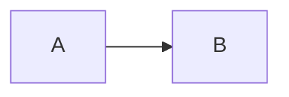

# HashiCorp Vault 학습 저장소

이 폴더는 HashiCorp Vault(시크릿 관리 / 암호화 도구)를 학습하기 위한 저장소입니다.
질문에 답하거나 문서를 작성할 때는 아래 규칙을 반드시 따르세요.

## 핵심 규칙

1. **공식문서 우선 검색**
   - 답변하기 전에 반드시 HashiCorp Vault 공식문서(https://developer.hashicorp.com/vault)를 WebFetch/WebSearch로 검색하고 근거를 확인한다.
   - 기억에 의존해 추측으로 답변하지 않는다. 특히 CLI 명령어, 설정 옵션, API 경로, 정책(Policy) 문법처럼 오타 하나로 동작이 달라지는 내용은 반드시 공식문서 원문을 확인한다.
   - 공식문서에 없는 내용(서드파티 튜토리얼, 블로그 등)을 인용할 때는 신뢰도 있는 출처(HashiCorp 공식 블로그, GitHub `hashicorp/vault` 리포지토리, 공식 GitHub Discussions 등)로 제한하고, 출처가 불확실한 정보는 "확실하지 않음"을 명시한다.
   - Vault는 버전마다 기능/문법 차이가 있으므로(예: KV v1 vs v2, 정책 문법 변경 등) 참고한 문서의 버전을 확인하고 필요 시 문서에 버전을 명시한다.

2. **출처 명시**
   - 새로 작성하는 학습 문서에는 참고한 공식문서 URL을 반드시 각주나 "참고 링크" 섹션에 남긴다.
   - 답변 중에도 핵심 근거가 된 공식문서 링크를 함께 제시한다.

3. **문서화**
   - 질문에 답한 뒤에는 내용을 `notes/` 폴더 아래 주제별 마크다운 문서로 정리해 남긴다 (재질문 시 재검색 대신 기존 문서를 우선 참고하고, 오래된 내용이면 재검증 후 갱신).
   - 문서 구조는 아래 "폴더 구조" 및 "문서 템플릿"을 따른다.
   - 이미 존재하는 주제 문서가 있으면 새로 만들지 말고 기존 문서를 업데이트한다.

4. **언어**
   - 문서와 답변은 한국어로 작성하되, Vault 고유 용어(예: seal/unseal, secrets engine, policy, token, lease, KV, PKI, Transit 등)는 원문 영어 용어를 그대로 병기한다.

5. **도식화(Mermaid) 적극 사용**
   - 구조, 흐름, 관계를 설명할 수 있는 내용은 텍스트 나열보다 **Mermaid 다이어그램으로 최대한 도식화**한다.
   - 예: 아키텍처 구성도(`graph`/`flowchart`), 인증~요청 처리 흐름(`sequenceDiagram`), 상태 전이(seal/unseal 등, `stateDiagram-v2`), 개념 간 관계(entity-policy-token 등, `graph`/`erDiagram`), 시간 흐름이 있는 절차 등.
   - 다이어그램은 공식문서의 설명을 임의로 왜곡하지 않는 범위에서 작성하고, 다이어그램만으로 불충분한 세부 사항은 이어서 텍스트로 보충한다.
   - 이미 작성된 ASCII 아트/텍스트 트리로 된 구조도가 있다면 Mermaid로 전환 가능한지 검토하고 전환한다.
   - **문법 주의사항** (파싱 오류 방지):
     - 노드/엣지 라벨 문자열(`"..."`) 안에 큰따옴표를 중첩하지 않는다. `\"`처럼 백슬래시로 이스케이프해도 Mermaid는 이를 지원하지 않아 파싱이 깨진다. 따옴표가 필요하면 작은따옴표를 쓰거나 문구를 풀어 쓴다.
     - 라벨 안 줄바꿈은 `\n`이 아니라 `<br/>`를 사용한다 (`\n`은 줄바꿈으로 렌더링되지 않는다).
     - 작성 후 가능하면 실제로 렌더링되는지(예: 이 저장소를 GitHub에서 미리보기) 확인한다.

## 폴더 구조

`notes/`는 하위 폴더 없이 평평하게(flat) 유지한다. 주제마다 폴더를 만들지 말고,
번호 접두사가 붙은 단일 마크다운 파일 하나로 관리한다. 번호는 학습 순서(기초 → 심화)를 따른다.

```
vault/
├── CLAUDE.md              # 이 파일 (규칙)
├── notes/                 # 학습 문서 (하위 폴더 없이 파일만 나열)
│   ├── 00_용어.md
│   ├── 01_아키텍쳐.md
│   ├── 02_인증방식.md      # auth methods
│   ├── 03_시크릿엔진.md    # secrets engines
│   ├── 04_정책.md          # policies
│   ├── 05_운영.md          # 설치, seal/unseal, HA, 백업 등
│   ├── 06_nginx-gateway-비교.md  # 실사용 사례 비교 (아래 참고)
│   └── ...                 # 필요 시 07, 08... 로 계속 이어감
└── labs/                   # 실습용 설정 파일, 스크립트 등 (있을 경우)
```

- 새 주제가 생기면 다음 번호를 붙인 새 파일을 추가한다 (예: `07_dynamic-secrets.md`).
- 한 주제 안의 세부 내용이 많아져도 폴더로 쪼개지 말고 해당 번호 파일 안에서 `##`/`###` 섹션으로 확장한다.
- 번호와 이름은 한 번 정해지면 임의로 재배치하지 않는다. 순서를 바꿔야 하면 사용자에게 먼저 확인한다.

### `06_nginx-gateway-비교.md` 전용 규칙

이 문서는 다른 노트와 달리 공식문서만으로 채울 수 없다. 다음 두 가지를 모두 조사해서 비교한다.

1. **현재 실사용 방식**: nginx-gateway 프로젝트가 실제로 Vault를 어떻게 사용하고 있는지 (설정 파일, 코드, 배포 스크립트 등 실제 소스를 근거로 조사 — 추측 금지).
2. **공식 권장 방식**: 같은 상황(예: 인증 방식, 시크릿 조회, 토큰 갱신 등)에 대해 HashiCorp Vault 공식문서가 권장하는 방식.

두 방식을 항목별로 나란히 비교하고, 차이가 있다면 원인과 리스크(보안, 유지보수 등)를 명시한다. 개선 제안은 "제안"임을 분명히 하고 단정하지 않는다.

## 문서 템플릿 (`notes/*.md`)

```markdown
# 주제명

## 요약
- 핵심 개념 2~3줄 요약

## 상세 설명
...

## 도식화 (Mermaid)


## 예시 (CLI / HCL / API 등)
...

## 참고 링크
- https://developer.hashicorp.com/vault/... (문서 버전/날짜 확인)
```
