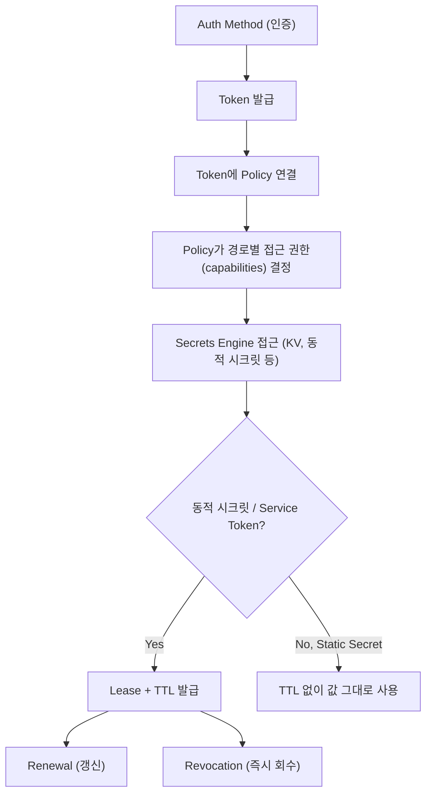

# 용어 (Terminology)

## 요약
- Vault는 데이터를 암호화하는 **Barrier**와 이를 영구 저장하는 **Storage Backend**로 이루어지며, 여러 서버가 하나의 storage를 공유해 Active/Standby로 동작하는 **Cluster**를 구성한다.
- 클라이언트는 **Auth Method**로 인증해 **Token**을 받고, Token에 연결된 **Policy**가 실제 접근 권한(경로 단위 capabilities)을 결정한다.
- **Secrets Engine**이 실제 시크릿을 저장/생성/암호화하며, 발급된 시크릿은 **Lease/TTL**을 가지고 **Renewal**(갱신) 또는 **Revocation**(회수)된다.

## 상세 설명

### Vault Server / Cluster
Vault는 여러 구성요소로 이루어진 시스템이며, 핵심 계층은 데이터를 암호화/복호화하는 **Barrier**와 데이터를 영구 보관하는 **Storage Backend**다.
여러 Vault 서버가 동일한 Storage Backend를 공유(HA 모드)하면, 항상 하나의 인스턴스만 **Active**(요청 처리) 상태이고 나머지는 **Standby**(요청을 Active로 리다이렉트) 상태로 클러스터를 구성한다. Active 노드가 seal되거나 실패하면 Standby 중 하나가 자동 승격된다.

### Seal / Unseal
**Seal**은 Vault 서버가 시작될 때의 기본 상태로, 물리 저장소에는 접근 가능하지만 데이터를 복호화할 수는 없는 상태다.
**Unseal**은 데이터 복호화에 필요한 평문 루트 키를 획득하는 과정이다. 기본 구성에서는 단일 키 대신 **Shamir's Secret Sharing** 알고리즘으로 키를 여러 조각(shares)으로 분할하며, 정해진 임계값(threshold)만큼 조각을 제공해야 unseal이 완료된다.
**Auto Unseal**은 unseal 키 보안 책임을 신뢰할 수 있는 외부 KMS 등에 위임하는 기능으로, 이 경우 unseal 키 대신 **recovery keys**를 사용한다.

### Storage Backend
Vault 정보를 영구 저장하는 위치로, 설정 파일의 `storage` stanza로 구성한다. Barrier(암호화 계층) 바깥에 위치하므로 신뢰할 수 없는 영역으로 취급되며, Vault는 데이터를 저장소에 보내기 전에 반드시 암호화한다. 대부분의 사용 사례에 **Integrated Storage(Raft 기반)**가 권장된다.

### Secrets Engine (KV v1 vs v2)
Secrets Engine은 데이터를 저장·생성·암호화하는 컴포넌트로, 가상 파일시스템처럼 read/write/delete로 동작한다.
- **KV v1**: 값을 새로 쓰면 이전 값이 완전히 덮어써지며(부분 병합 불가), 값(value)만 암호화되고 경로/키 이름은 암호화되지 않는다. `ttl`을 지정할 수 있지만 데이터가 자동 삭제되지는 않는다.
- **KV v2**: **버전 관리(versioning)**와 **소프트 삭제**를 지원한다. 소프트 삭제는 데이터를 접근 불가능하게 하되 복구 가능하게 하며, 필요 시 특정 버전을 영구 삭제(destroy)할 수 있다.

### Auth Method
인증을 수행하고 사용자에게 identity와 policy 집합을 부여하는 컴포넌트. 모든 요청은 인증을 거쳐야 하며, AWS/GitHub/Google Cloud 등 외부 인증 서비스에 위임하는 경우가 많다. 여러 Auth Method를 동시에 활성화할 수 있다.
대표 종류: Token(기본), AppRole, Kubernetes, AWS/Azure/GCP, GitHub, LDAP, Username & Password 등.

### Token (Root / Service / Batch)
토큰은 Vault 인증의 핵심 수단이며, Auth Method를 통해 동적으로 생성되거나 직접 생성된다. 토큰에 연결된 Policy가 보유자의 권한 범위를 결정한다.
- **Root Token**: root 정책이 부여되어 Vault의 모든 작업을 수행할 수 있는 특수 토큰. 만료되지 않도록 설정 가능한 유일한 토큰 유형. 초기 설치/긴급 상황에만 사용 후 즉시 폐기(revoke)할 것을 권장.
- **Service Token**: 전통적인 토큰으로 갱신(renew), 자식 토큰 생성, periodic token 등 모든 기능을 지원하지만 디스크에 추적/저장되어야 해 상대적으로 무겁다.
- **Batch Token**: 암호화된 형태로 인코딩되어 별도 저장소 추적이 불필요한 경량 토큰. 갱신 불가, 자식 토큰 생성 불가, periodic 미지원이지만 성능이 가볍다.

### Policy (HCL 문법)
경로(path)와 작업(capabilities)에 대한 접근을 선언적으로 허용/거부하는 규칙. 기본 원칙은 **거부 우선(deny by default)**이며, 빈 정책은 아무 권한도 부여하지 않는다.
경로는 정확한 매칭, 와일드카드(`secret/*`), 글롭 패턴을 지원하며 `allowed_parameters`/`denied_parameters`/`required_parameters`로 파라미터 단위 제어도 가능하다.

### Lease / TTL / Renewal / Revocation
- **Lease**: 동적 시크릿·서비스 토큰 발급 시 생성되는 메타데이터(기간, 갱신 가능 여부 등 포함).
- **TTL**: 데이터가 유효한 기간(Time To Live).
- **Renewal**: 만료 전 Vault에 접속해 lease 기간을 연장하는 행위.
- **Revocation**: lease를 즉시 무효화하고 추가 갱신을 막는 작업(자동/수동 가능).

### Dynamic Secrets vs Static Secrets
- **Static Secrets**: 누군가 수동으로 변경하지 않는 한 갱신되지 않는 고정 비밀정보(대표 예: KV secrets engine).
- **Dynamic Secrets**: 클라이언트가 읽을 때 비로소 생성되며, 사용 후 Vault의 revocation 메커니즘으로 자동 회수되어 노출 위험이 크게 줄어든다.

### Vault Agent / Vault Proxy
애플리케이션 옆에서 별도로 실행되는 **클라이언트 데몬**으로, 애플리케이션 코드를 수정하지 않고도 Vault 인증·시크릿 조회를 대신 처리해준다. 둘 다 **Vault Enterprise 라이선스 없이 모든 Vault 바이너리에 기본 포함**되어 있다(= OSS에서도 사용 가능). 다만 아래 표의 "정적 시크릿 캐싱"만은 예외적으로 Enterprise가 필요하다.

| 기능 | Vault Agent | Vault Proxy |
|---|---|---|
| Auto-Auth (자동 인증/토큰 갱신) | ✅ | ✅ |
| 토큰/리스 캐싱 | ✅ | ✅ |
| API Proxy | **지원 중단(Deprecated)** — Proxy 사용 권장 | ✅ |
| Templating(시크릿을 파일로 렌더링) | ✅ | ❌ |
| Process Supervisor(시크릿을 환경변수로 주입해 자식 프로세스 실행) | ✅ | ❌ |
| 정적 시크릿(KV) 캐싱 | ❌ | ✅ (**Vault Enterprise 전용** — 아래 설명) |

- **Auto-Auth**: 설정된 Auth Method로 Agent/Proxy가 스스로 인증하고 토큰을 자동 갱신하는 기능. 애플리케이션은 인증 로직을 직접 구현할 필요가 없다.
- **API Proxy**: 애플리케이션의 Vault API 요청을 대신 전달(프록시)해주는 기능. 공식문서는 Vault Agent의 API Proxy 기능이 지원 중단되었다고 명시하며 **Vault Proxy 사용을 권장**한다.
- **정적 시크릿 캐싱**: Vault Proxy가 KV(v1/v2) 시크릿을 캐싱해 동일 시크릿에 대한 반복 요청이 매번 Vault 서버까지 가지 않도록 한다. 캐시 무효화(invalidation)를 위해 auto-auth 토큰으로 KV **Event Notifications**를 구독하는데, Event Notifications 자체가 공식문서에 "Appropriate Vault Enterprise license required"로 명시된 **Enterprise 전용 기능**이라 정적 시크릿 캐싱도 사실상 Enterprise 환경에서만 동작한다.
- Vault 서버 입장에서 Agent/Proxy는 특별한 신뢰 컴포넌트가 아니라 **Auth Method로 인증하는 여느 클라이언트와 동일**하게 취급된다([`notes/01_아키텍쳐.md`](../notes/01_아키텍쳐.md#vault-agent--vault-proxy-클라이언트-데몬) 참고).

### Namespace (Vault Enterprise 전용)
격리된 환경을 수립해 Vault 설치 내에서 "미니 Vault 인스턴스"처럼 동작하는 기능. Namespace마다 Secrets Engine, Auth Method, Policy, Entity/Group, Token 등을 독립적으로 관리할 수 있다.
**주의**: Namespace 및 Secure Multi-Tenancy는 **Vault Enterprise 라이선스 또는 HCP Vault Dedicated 클러스터**가 필요한 엔터프라이즈 전용 기능이다 (OSS Vault에는 없음).

### Identity / Entity / Group
- **Identity**: Vault가 인식하는 클라이언트를 유지하기 위한 개념으로, Identity Secrets Engine을 통해 관리된다.
- **Entity**: 서로 다른 인증 공급자(Auth Method)의 계정을 하나의 통합된 신원으로 표현한 것. 하나의 Entity는 특정 Auth Method당 최대 하나의 alias만 가질 수 있다. 예: GitHub과 LDAP 계정을 가진 사용자는 하나의 Entity + alias 2개로 매핑된다.
- **Group**: 여러 Entity를 멤버로 포함할 수 있고 서브그룹도 가질 수 있다. Group에 부여된 Policy는 모든 멤버 Entity에 상속된다.

## 예시 (정책 HCL)

```hcl
path "secret/foo" {
  capabilities = ["read"]
}
```

## 관계 흐름 요약



## 참고 링크
- https://developer.hashicorp.com/vault/docs/internals/architecture
- https://developer.hashicorp.com/vault/docs/internals/high-availability
- https://developer.hashicorp.com/vault/docs/concepts/seal
- https://developer.hashicorp.com/vault/docs/configuration/storage
- https://developer.hashicorp.com/vault/docs/secrets
- https://developer.hashicorp.com/vault/docs/secrets/kv/kv-v1
- https://developer.hashicorp.com/vault/docs/secrets/kv/kv-v2
- https://developer.hashicorp.com/vault/docs/auth
- https://developer.hashicorp.com/vault/docs/concepts/tokens
- https://developer.hashicorp.com/vault/docs/concepts/policies
- https://developer.hashicorp.com/vault/docs/concepts/lease
- https://developer.hashicorp.com/vault/tutorials/get-started/understand-static-dynamic-secrets
- https://developer.hashicorp.com/vault/docs/agent-and-proxy
- https://developer.hashicorp.com/vault/docs/agent-and-proxy/agent
- https://developer.hashicorp.com/vault/docs/agent-and-proxy/proxy
- https://developer.hashicorp.com/vault/docs/agent-and-proxy/proxy/caching
- https://developer.hashicorp.com/vault/docs/concepts/events
- https://developer.hashicorp.com/vault/docs/enterprise/namespaces
- https://developer.hashicorp.com/vault/docs/concepts/identity

> 참고: "Vault Cluster"에 대한 단일 정의 문구는 공식문서에서 별도로 찾지 못했고 HA 문서의 다중 노드 구조 설명으로 대체했습니다. Storage Backend 상세 목록 페이지(`/vault/docs/internals/storage-backends`)는 현재 접근 불가하여 `/vault/docs/configuration/storage`와 `/vault/docs/internals/architecture`로 대체 확인했습니다.
