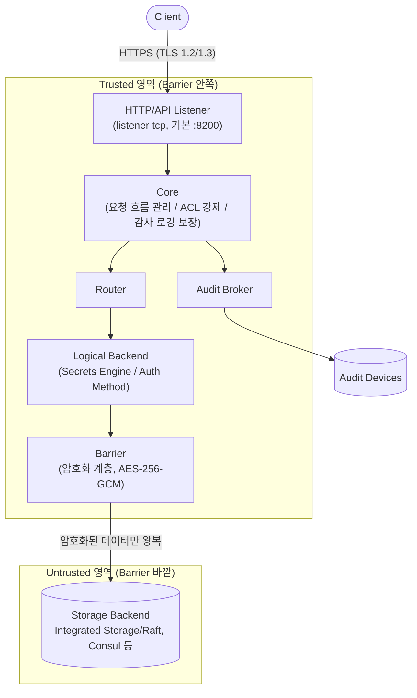
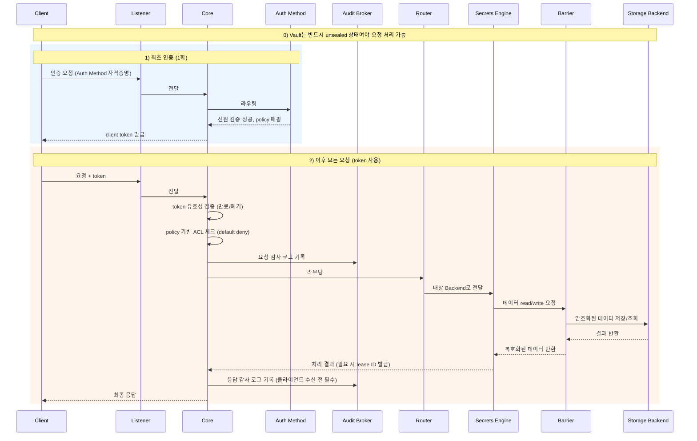
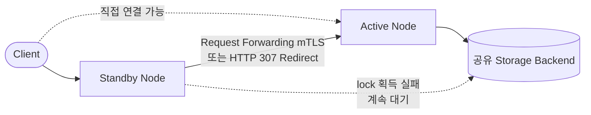

# 아키텍처 (Architecture)

## 요약
- Vault 요청은 **HTTP/API Listener → Core → Router → Logical Backend(Secrets Engine/Auth Method) → Barrier → Storage Backend** 순으로 처리된다.
- **Barrier**를 기준으로 안쪽(Core, Router, Backend)은 **trusted**, 바깥쪽(Storage Backend)은 **untrusted** 영역이며, 모든 데이터는 Barrier에서 암호화된 뒤에만 Storage로 나간다.
- HA 구성에서는 하나의 **Active** 노드만 요청을 처리하고, 나머지 **Standby** 노드는 요청을 Active로 전달(forwarding)한다.

## 상세 설명

### 전체 구성요소
- **HTTP/API Listener**: 클라이언트 요청의 진입점. `listener "tcp"` stanza로 설정하며 기본 바인딩은 `127.0.0.1:8200`, 클러스터 통신 포트는 보통 그보다 1 높은 포트(예: 8201). TLS가 기본 활성화되어 TLS 1.2/1.3만 허용하며 `tls_cert_file`/`tls_key_file`(PEM)/`tls_disable`(기본 false) 등을 설정한다.
- **Core**: 요청 흐름을 관리하고, ACL(Policy 기반 접근 제어)을 강제하며, 감사 로깅이 이루어지도록 보장하는 중심 컴포넌트.
- **Router**: Core가 처리한 요청을 적절한 Backend(Secrets Engine/Auth Method)로 라우팅.
- **Logical Backend(Secrets Engine / Auth Method)**: 실제 로직이 동작하는 곳. 데이터를 읽거나 쓸 때는 반드시 Barrier를 거친다.
- **Barrier**: 모든 데이터가 Storage로 나가기 전 암호화/복호화를 수행하는 암호화 계층.
- **Storage Backend**: 암호화된 데이터가 실제로 영속화되는 곳(Integrated Storage/Raft, Consul 등).
- **Audit Broker/Device**: Core가 모든 요청·응답을 감사 로그로 기록.

### Barrier와 신뢰 경계(Trust Boundary)
Barrier는 "Vault의 암호화 계층"으로, 데이터를 암호화/복호화하는 책임을 진다. Storage Backend는 Barrier 바깥에 위치하므로 **untrusted**로 간주되며, Vault는 Storage로 보내기 전 데이터를 반드시 암호화한다(AES-256-GCM, 96-bit nonce, 인증 태그로 변조 탐지). 즉 Storage Backend 자체의 보안은 신뢰하지 않는 것이 Vault의 설계 전제다.

### Storage Backend 종류
- **Integrated Storage(Raft)**: Vault 내장 방식으로 별도 소프트웨어가 필요 없고 동일 호스트에 저장되어 네트워크 홉이 1회이며 트러블슈팅이 쉽다.
- **외부 Storage(Consul 등)**: 별도 인프라 설치/관리가 필요하고 물리적으로 분리된 호스트에 위치해 네트워크 오버헤드가 추가된다.
- 공식 권장: "HashiCorp recommends using Vault's integrated storage for most use cases rather than configuring another system to store Vault data externally."
- 두 방식 모두 Barrier 뒤(암호화된 데이터만 존재)에서 동작하는 영속화 계층이라는 점은 동일하다.

### High Availability(HA)
- 여러 노드가 storage의 lock을 획득하기 위해 경쟁하며, 성공한 노드가 **Active**, 나머지는 **Standby**가 된다.
- **Request Forwarding(기본)**: Standby가 클라이언트 요청을 상호 인증 TLS(mTLS)로 Active에 전달하고, Active가 처리한 응답을 다시 돌려준다.
- **Client Redirection(대체 방식)**: HTTP 307로 클라이언트를 Active로 리다이렉트하며, `X-Vault-No-Request-Forwarding` 헤더로 forwarding을 강제로 끌 수 있다.
- Raft(Integrated Storage) 사용 시 Leader Election은 Raft 프로토콜 자체가 담당하며, HashiCorp는 신규 배포에 Integrated Storage를 기본 HA 백엔드로 권장한다.
- "HA does not enable increased scalability." — HA는 확장성이 아니라 가용성을 위한 것이며, Vault의 병목은 대개 core가 아니라 데이터 저장소 자체다.
- HA lock 저장소(`ha_storage`)와 데이터 저장소(`storage`)를 분리하는 split storage 구성도 지원한다.

### Audit Device
Audit device는 모든 API 요청·응답을 상세히 기록하며, 운영 프로세스 로그(서버 로그)와는 별개다. 핵심 규칙은 **"클라이언트가 비밀 정보(secret material)를 응답으로 받기 전에 요청/응답이 반드시 감사 로그로 기록되어야 한다"**는 것이다. 활성화된 모든 audit device로 로그가 전송되며 최소 1개 device로의 기록 성공을 보장한다.

### Replication (참고: Enterprise 전용)
Performance Replication과 Disaster Recovery(DR) Replication은 모두 **Vault Enterprise 라이선스 또는 HCP Vault Dedicated 클러스터가 필요한 Enterprise 전용 기능**이며, OSS(커뮤니티 에디션)에서는 사용할 수 없다.

## 도식화 (Mermaid)

### 내부 컴포넌트 구조 및 신뢰 경계


### 클라이언트 요청 → 응답 전체 흐름


### HA: Active/Standby 요청 처리


## 예시 (Listener 설정)

```hcl
listener "tcp" {
  address       = "0.0.0.0:8200"
  tls_cert_file = "/etc/vault/tls/vault.crt"
  tls_key_file  = "/etc/vault/tls/vault.key"
}
```

## 참고 링크
- https://developer.hashicorp.com/vault/docs/internals/architecture
- https://developer.hashicorp.com/vault/docs/internals/security
- https://developer.hashicorp.com/vault/docs/configuration/storage
- https://developer.hashicorp.com/vault/docs/concepts/ha
- https://developer.hashicorp.com/vault/docs/configuration/listener/tcp
- https://developer.hashicorp.com/vault/docs/audit
- https://developer.hashicorp.com/vault/docs/enterprise/replication
