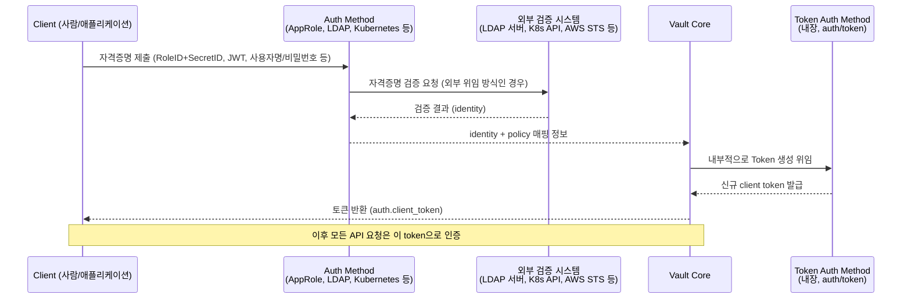
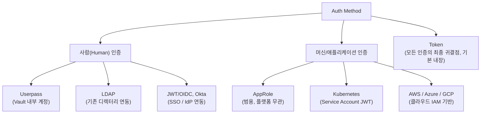

# 인증방식 (Auth Methods)

## 요약
- Auth Method는 사용자/시스템의 신원(identity)을 확인하고 Policy 집합을 부여하는 컴포넌트다. 어떤 Auth Method를 쓰든 최종적으로는 **Token**이 발급되며, 이후 요청은 이 Token으로 인증한다.
- Auth Method는 여러 개를 동시에 활성화할 수 있고(`vault auth enable`), 상황에 맞는 방식을 조합해 쓰는 것이 권장된다.
- 크게 **사람(human) 대상**(Userpass, LDAP, OIDC 등)과 **머신/애플리케이션 대상**(AppRole, Kubernetes, AWS/Azure/GCP 등)으로 나뉜다.

## 상세 설명

### Auth Method란
"Auth methods are the components in Vault that perform authentication and are responsible for assigning identity and a set of policies to a user."(공식문서) — 인증을 수행하고, 인증된 대상에게 identity와 Policy 집합을 부여하는 컴포넌트다.

Vault의 모든 요청은 인증을 거쳐야 하며, Vault 자체 로직으로 자격증명을 검증할 수도 있고 AWS/GitHub/LDAP 같은 외부 시스템에 검증을 위임할 수도 있다. 외부 시스템에서 사용자 상태가 바뀌면(예: 계정 비활성화) 이미 발급된 토큰 자체는 유효하지만, **토큰 갱신(renewal) 시점에 재검증되어 갱신이 거부**될 수 있다.

### 모든 인증은 결국 Token으로 귀결된다
Token Auth Method는 `/auth/token` 경로에 **기본 내장(built-in)되어 항상 활성화**되어 있으며, 별도 설정이 필요 없다.

"When any other auth method returns an identity, Vault core invokes the token method to create a new unique token for that identity."(공식문서) — 즉 AppRole이든 LDAP이든 어떤 방식으로 인증하더라도, Vault Core는 내부적으로 Token Auth Method를 호출해 해당 identity를 대표하는 고유 토큰을 생성한다. 이 토큰이 이후 모든 API 호출의 인증 수단이 된다.

### Auth Method 활성화/비활성화
```bash
vault auth enable userpass              # 기본 경로: auth/userpass
vault auth enable -path=my-login userpass  # 커스텀 경로
vault auth disable userpass
```
- 여러 Auth Method를 **동시에 활성화**할 수 있다. "Having multiple auth methods enables you to use an auth method that makes the most sense for your use case."(공식문서)
- Auth Method를 **비활성화하면 해당 방식으로 인증된 모든 사용자가 로그아웃**된다(발급된 토큰이 즉시 무효화됨).

### 대표 Auth Method

#### Token
- `/auth/token`에 기본 활성화되어 있으며 모든 인증의 최종 귀결점.
- 다른 Auth Method를 거치지 않고 직접 토큰을 생성/갱신/폐기하는 용도로도 쓰인다.
- Login MFA와는 호환되지 않는다(Token 자체는 "로그인" 개념이 아니라 이미 발급된 자격증명이기 때문).

#### AppRole — 머신/애플리케이션 인증
CI/CD, 마이크로서비스, 컨테이너 오케스트레이션처럼 **사람이 아닌 애플리케이션이 스스로 인증**해야 하는 상황을 위한 방식이다.

- **RoleID**: 특정 AppRole을 식별하는 값(기본 UUID). 로그인 시 항상 필요.
- **SecretID**: 보호되어야 하는 자격증명. **Pull 모드**(Vault가 생성해 안전하게 배포)와 **Push 모드**(사용자가 직접 설정) 두 방식이 있으며, Pull 모드가 더 안전하다.
- 인증 흐름: RoleID + SecretID를 `auth/approle/login`에 제출 → Vault가 검증 → Policy와 TTL이 반영된 토큰 발급.

주요 설정:

| 옵션 | 역할 |
|---|---|
| `bind_secret_id` | SecretID 필수 여부 |
| `secret_id_ttl` | SecretID 유효 기간 |
| `token_ttl` | 발급 토큰 유효 기간 |
| `secret_id_num_uses` | SecretID 사용 횟수 제한 |
| `token_type` | `service` 또는 `batch` 토큰 유형 |

#### Userpass — 사람 인증
사용자명/비밀번호 조합을 **Vault 내부(`users/` 경로)에 직접 등록**해 인증하는 방식(외부 디렉터리 연동 없음).

- 사용자명은 소문자로 정규화된다(`Mary` → `mary`).
- v1.13+부터 **Lockout 기능이 기본 활성화**: 임계값 5회 실패 시 15분간 잠금(설정으로 조정/비활성화 가능).
- 별도 사용자 저장소를 두지 않는 간단한 구성에 적합하지만, 조직 규모가 커지면 LDAP/OIDC 같은 중앙 디렉터리 연동이 더 권장되는 경향이 있다(공식문서에 "프로덕션 비권장"이라는 명시적 문구는 없음 — 확실하지 않음).

#### LDAP — 사람 인증 (기존 디렉터리 연동)
"기존 LDAP 서버와 사용자/암호 자격증명을 사용하여 인증"하는 방식으로, 여러 시스템에 사용자 정보를 중복 관리하지 않도록 통합한다.

Bind 방식 두 가지:
- **Direct User Bind**: UPN(`username@example.com`) 형식으로 사용자가 직접 bind. 별도 서비스 계정 불필요.
- **Authenticated Search**: `binddn`/`bindpass`로 지정한 서비스 계정이 먼저 bind → 대상 사용자를 검색 → 인증. 검색된 사용자 객체를 따라 **그룹 멤버십**도 확인 가능.

LDAP 그룹을 Vault Policy에 매핑해 그룹 기반으로 권한을 자동 부여할 수 있다. 단, **정책 매핑은 토큰 생성 시점에 고정**되므로, 이후 LDAP 서버에서 그룹이 바뀌어도 이미 발급된 토큰에는 반영되지 않는다(재로그인해야 반영).

#### Kubernetes — 워크로드 인증
Pod가 자동으로 마운트받는 **Service Account Token(JWT)**을 이용해 인증하는 방식.

인증 흐름:
1. Pod 내부에서 마운트된 Service Account JWT를 읽음.
2. 이 JWT와 role 이름을 `auth/kubernetes/login`으로 제출.
3. Vault가 Kubernetes **TokenReview API**를 호출해 JWT 유효성을 검증한다. 이를 위해 Vault가 사용하는 Service Account에는 `system:auth-delegator` ClusterRole이 필요하다.
4. 검증 성공 시 Policy가 반영된 토큰 발급(`auth.client_token`).

Role은 Kubernetes Service Account ↔ Vault Policy를 연결하는 바인딩이며, 주요 설정은 다음과 같다.

| 옵션 | 역할 |
|---|---|
| `bound_service_account_names` | 인증을 허용할 Service Account 이름 제한 |
| `bound_service_account_namespaces` | 인증을 허용할 네임스페이스 제한 |
| `policies` | 부여할 Vault Policy |

#### AWS — 클라우드 워크로드 인증
"수동으로 보안 자격증명을 미리 배포할 필요 없이" AWS IAM Principal이나 EC2 인스턴스가 자동으로 Vault Token을 얻는 방식. 두 가지 하위 타입이 있다.

| 구분 | IAM 방식 | EC2 방식 |
|---|---|---|
| 검증 대상 | AWS STS `GetCallerIdentity` API 서명(SigV4) | EC2 인스턴스 메타데이터 + PKCS#7 서명 |
| 장점 | 동적/단기 자격증명, 재생 공격에 강함 | AMI ID·태그 기반의 세분화된 제어 가능 |
| 단점 | EC2 인스턴스 속성 기반의 세밀한 제어는 어려움 | 상대적으로 정적인 메타데이터라 탈취 위험이 더 높음 |

공식문서는 "IAM 방식이 더 유연하고 모범 사례에 부합"한다고 권장한다.

#### 그 외 Auth Method (요약만)
아래는 공식문서에 등재된 대표 Auth Method 목록이며(20종 이상 중 일부), 필요 시 개별 문서를 추가로 조사해 이 파일에 절을 보강한다.

| Auth Method | 용도 |
|---|---|
| Azure / Google Cloud | AWS와 유사한 개념의 클라우드 워크로드 인증 |
| GitHub | GitHub Personal Access Token으로 팀 기반 인증 |
| JWT/OIDC | 외부 OIDC Provider(IdP) 연동, SSO 로그인 흐름 지원 |
| Okta | Okta 계정/그룹 기반 인증 |
| TLS Certificates | 클라이언트 인증서(mTLS) 기반 인증 |
| SAML | Enterprise 전용, SAML IdP 연동 |

### 발급된 Token의 TTL / 갱신 / 재인증 흐름
Auth Method로 최초 인증한 뒤에는, 매 요청마다 원래 자격증명(비밀번호, RoleID+SecretID, LDAP 계정 등)을 다시 제출하지 않는다. 대신 **발급된 Token 자체가 `X-Vault-Token` 헤더를 통해 인증 수단**이 되며, 이 상태는 Token의 TTL 동안만 유지된다.

- **TTL 만료**: "After the current TTL is up, the token will no longer function -- it, and its associated leases, are revoked."(공식문서) — TTL이 지나면 Token과 거기 딸린 모든 Lease가 자동으로 폐기(revoke)된다.
- **Renewal(갱신)**: TTL 만료 전에 갱신을 요청하면 TTL이 연장된다. 단, 연장 가능한 한계는 **Max TTL**이며, 다음 세 가지 중 가장 짧은 값으로 결정된다.
  1. 시스템 기본값(기본 32일, 설정으로 변경 가능)
  2. Auth Method가 마운트된 경로(mount)의 설정값
  3. Auth Method(또는 Role)가 제안하는 값(마운트 값보다 길 수 없음)
- **Periodic Token**: 장기 실행 서비스를 위한 예외로, 갱신할 때마다 TTL이 설정된 period로 다시 리셋된다. 명시적인 Max TTL이 별도로 걸려 있지 않은 한 사실상 만료 없이 계속 갱신하며 쓸 수 있다.
- **만료 후 재접근**: Token이 완전히 만료되면 그 Token으로는 더 이상 아무 요청도 할 수 없다. 처음 등록해둔 자격증명으로 **해당 Auth Method의 로그인 절차를 다시 수행해 새 Token을 발급받아야** 한다(재인증).

### Auth Method 선택 기준 (일반적 구분)
- **사람이 로그인**하는 경우: Userpass(소규모), LDAP/OIDC/Okta(중앙 디렉터리 연동, 조직 규모가 클 때)
- **애플리케이션/워크로드가 스스로 인증**하는 경우: AppRole(범용, 플랫폼 무관), Kubernetes(K8s 네이티브), AWS/Azure/GCP(해당 클라우드에서 실행되는 워크로드)

## 도식화 (Mermaid)

### Auth Method → Token 발급 공통 흐름


### 사람 vs 머신 Auth Method 분류


## 예시 (CLI)

```bash
# AppRole 활성화 및 로그인
vault auth enable approle
vault write auth/approle/role/my-role token_policies="my-policy" token_ttl=20m
vault read auth/approle/role/my-role/role-id
vault write -f auth/approle/role/my-role/secret-id
vault write auth/approle/login role_id="<role_id>" secret_id="<secret_id>"

# Kubernetes 활성화 및 로그인
vault auth enable kubernetes
vault write auth/kubernetes/config kubernetes_host="https://<K8S_API_HOST>"
vault write auth/kubernetes/role/my-role \
  bound_service_account_names="myapp" \
  bound_service_account_namespaces="default" \
  policies="my-policy" ttl=1h
```

## 참고 링크
- https://developer.hashicorp.com/vault/docs/auth
- https://developer.hashicorp.com/vault/docs/auth/token
- https://developer.hashicorp.com/vault/docs/auth/approle
- https://developer.hashicorp.com/vault/docs/auth/userpass
- https://developer.hashicorp.com/vault/docs/auth/ldap
- https://developer.hashicorp.com/vault/docs/auth/kubernetes
- https://developer.hashicorp.com/vault/docs/auth/aws
- https://developer.hashicorp.com/vault/docs/concepts/tokens
- https://developer.hashicorp.com/vault/docs/concepts/lease

> 참고: "그 외 Auth Method" 표(Azure/GCP/GitHub/JWT-OIDC/Okta/TLS Certificates/SAML)는 https://developer.hashicorp.com/vault/docs/auth 목록 페이지 기준 개요 수준으로만 정리했으며, 각 방식의 상세 설정은 아직 개별 공식문서로 검증하지 않았다. 필요 시 추가 조사 후 이 문서에 절을 보강한다.
