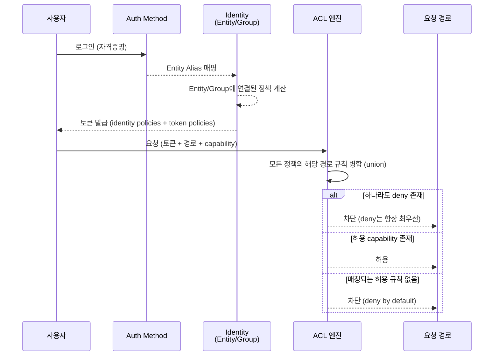
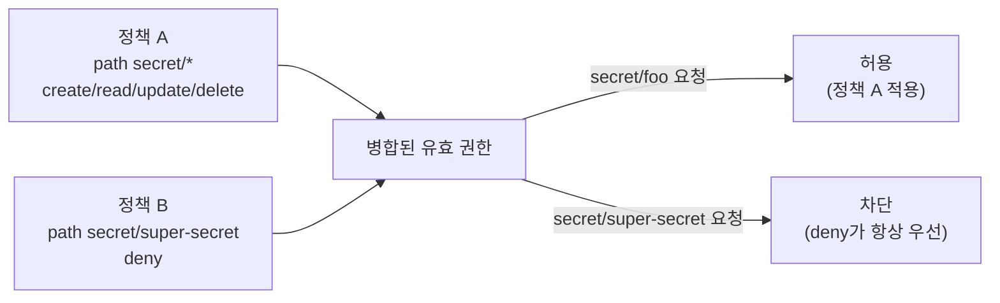
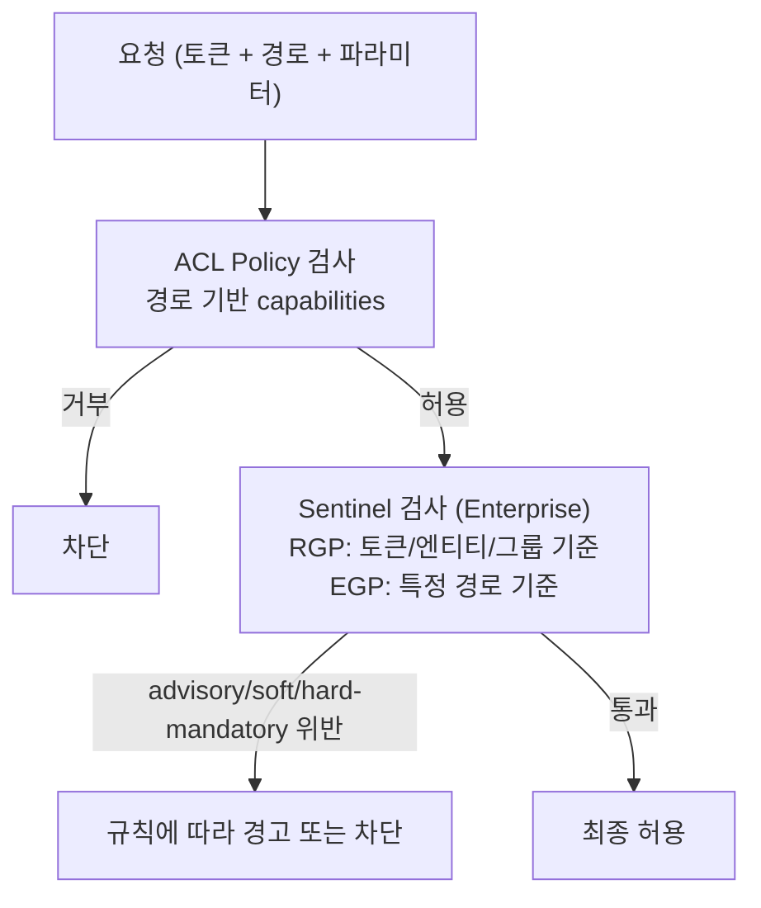

# 정책 (Policies)

## 요약
- Vault의 정책은 **경로(path) 기반 ACL**이며 기본값은 거부(deny by default) — "Policies are deny by default, so an empty policy grants no permission in the system."(공식문서)
- 정책은 경로별로 `capabilities`(create/read/update/patch/delete/list/sudo/deny 등)를 부여하고, **`deny`는 다른 모든 권한보다 항상 우선**한다.
- **Templated Policy**로 `{{identity.entity.name}}` 같은 값을 경로에 삽입하면, 사용자마다 별도 정책을 쓰지 않고도 "각자 자신의 경로만" 접근하게 만들 수 있다.
- Enterprise 전용 **Sentinel(RGP/EGP)** 은 ACL을 대체하지 않고 보완하는 추가 계층이다.

## 상세 설명

### ACL Policy란
Vault의 정책(Policy)은 "누가 어떤 경로(path)에서 무엇을 할 수 있는가"를 선언적으로 정의하는 **경로 기반 접근 제어(ACL, Access Control List)** 메커니즘이다. HCL 또는 JSON으로 작성하며, [[02_인증방식]]이 "누구인지"를 증명하는 단계라면 정책은 그 뒤에 오는 **인가(Authorization)** 단계를 담당한다.

가장 중요한 원칙은 **명시적 허용(allowlist) 방식**이라는 점이다: "Policies are deny by default, so an empty policy grants no permission in the system."(공식문서) — 즉 어떤 경로에 대해 아무 정책도 없으면 접근이 거부되고, 접근을 허용하려면 반드시 해당 경로에 대한 capability를 명시해야 한다.

### Default Policy / Root Policy
| 정책 | 설명 |
|---|---|
| **default** | "The default policy is a built-in Vault policy that cannot be removed."(공식문서) 모든 토큰에 자동으로 첨부되며, 토큰 자신의 메타데이터 조회, cubbyhole(개인 저장소) 접근 등 기본 동작을 제공한다. 관리자가 내용을 수정할 수는 있다. |
| **root** | "Any user associated with this policy becomes a root user. A root user can do anything within Vault."(공식문서) 수정·제거가 불가능한 내장 정책이며, 프로덕션에서는 초기 설정(initial setup) 이후 **root 토큰을 폐기(revoke)** 하는 것이 권장된다. |

```bash
vault token revoke "<root-token>"
```

### Capabilities (권한 종류)
Capability는 대체로 **HTTP 동사에 매핑**된다 — "Capabilities usually map to the HTTP verb, and not the underlying action taken."(공식문서) 예를 들어 동적 DB 자격증명 발급([[03_시크릿엔진]] 참고)은 실제로는 "생성" 행위이지만 HTTP로는 GET 요청이므로 `read` capability가 필요하다.

| Capability | 대응 HTTP 동사 | 의미 |
|---|---|---|
| create | POST/PUT | "Allows creating data at the given path."(공식문서) |
| read | GET | 해당 경로 데이터 조회 |
| update | POST/PUT | "Allows changing the data at the given path."(공식문서) |
| patch | PATCH | 부분 업데이트 허용 |
| delete | DELETE | 데이터 삭제 |
| list | LIST | "Allows listing values at the given path."(공식문서) |
| sudo | - | "Allows access to paths that are root-protected."(공식문서) — root-protected 경로(예: 특정 `sys/` 하위)에 접근하려면 sudo가 추가로 필요 |
| deny | - | "Disallows access. This always takes precedence regardless of any other defined capabilities, including sudo."(공식문서) |
| recover | - | 스냅샷으로부터 데이터 복구 |
| subscribe | - | 이벤트 구독 |

### Path 매칭 규칙
```hcl
# 정확히 일치하는 경로만
path "secret/foo" {
  capabilities = ["read"]
}

# glob(*) — 마지막 문자로만 사용 가능, 하위 경로 전체 매칭
path "secret/bar/*" {
  capabilities = ["read"]
}
# secret/bar/zip, secret/bar/zip/zap 은 매칭됨
# secret/bars/zip 은 매칭 안 됨 (접두사만 같음)

# wildcard(+) — 세그먼트 하나를 임의 값으로 대체
path "secret/+/teamb" {
  capabilities = ["read"]
}
# "Permit reading the 'teamb' path under any top-level path under secret/."(공식문서)
```

### 우선순위(가장 구체적인 매치 우선) & 정책 병합
"The policy rules that Vault applies are determined by the most-specific match available."(공식문서) 아래 순서로 구체성이 낮다고 판단되어 우선순위가 밀린다:

1. `+`(wildcard) 또는 `*`(glob)이 경로에서 더 일찍 등장할수록 우선순위 낮음
2. `*`로 끝나고 그 외에 특수문자가 없으면 우선순위 낮음
3. `+` 세그먼트 개수가 많을수록 우선순위 낮음
4. 경로 길이가 짧을수록 우선순위 낮음
5. 사전순으로 앞설수록 우선순위 낮음

토큰에는 보통 **여러 정책이 동시에 첨부**된다. 서로 다른 정책이 같은 경로 패턴을 정의하면 Vault는 **권한의 합집합(union)** 을 적용한다. 단, `deny`가 하나라도 있으면 그 경로는 다른 정책이 무엇을 허용하든 **무조건 차단**된다.

```hcl
# 정책 A
path "secret/*" {
  capabilities = ["create", "read", "update", "delete"]
}
# 정책 B (같은 토큰에 첨부됨)
path "secret/super-secret" {
  capabilities = ["deny"]
}
```
→ `secret/*`가 전체 권한을 부여해도 `secret/super-secret`은 deny로 인해 항상 차단된다.

### Fine-Grained Control: 파라미터 단위 제어
경로 단위를 넘어 **요청 파라미터 값**까지 제어할 수 있다.

```hcl
path "secret/foo" {
  capabilities = ["create"]
  allowed_parameters = {
    "bar" = ["zip", "zap"]  # bar는 zip 또는 zap 값만 허용
    "*"   = []               # 그 외 파라미터는 값 제한 없이 허용
  }
}
```
"Setting a parameter with a value of the empty list allows the parameter to contain any value."(공식문서) — 빈 배열(`[]`)은 "이 파라미터는 있어도 되고 값은 아무거나"라는 뜻이다.

```hcl
path "auth/userpass/users/*" {
  capabilities = ["update"]
  denied_parameters = {
    "token_policies" = []   # token_policies 파라미터 자체를 변경 금지
  }
}
```
"Any values specified here take precedence over allowed_parameters."(공식문서) — `denied_parameters`가 `allowed_parameters`보다 항상 우선한다.

```hcl
path "secret/profile" {
  capabilities = ["create"]
  required_parameters = ["name", "id"]  # 반드시 포함해야 하는 파라미터
}
```

파라미터 값에도 접두사/접미사 매칭용 glob(`*`)을 쓸 수 있다: `allowed_parameters = { "bar" = ["foo-*"] }`.

### Response Wrapping TTL 제약
```hcl
path "auth/approle/role/my-role/secret-id" {
  capabilities     = ["create", "update"]
  min_wrapping_ttl = "1s"
  max_wrapping_ttl = "90s"
}
```
- `min_wrapping_ttl`: "Setting a minimum TTL of one second effectively makes response wrapping mandatory."(공식문서) — 최소 TTL을 강제해 사실상 response wrapping을 필수화할 수 있다.
- `max_wrapping_ttl`: 클라이언트가 요청할 수 있는 wrap TTL의 상한.
- 여러 정책이 겹치면 **가장 낮은 값**이 적용된다.

### Templated Policy — 엔티티/그룹 정보를 경로에 동적 삽입
정적으로 경로를 나열하는 대신, [[02_인증방식]]에서 다룬 Identity(entity/entity alias/group) 정보를 경로 문자열에 템플릿으로 삽입할 수 있다.

| 템플릿 파라미터 | 의미 |
|---|---|
| `identity.entity.id` | 엔티티 고유 ID |
| `identity.entity.name` | 엔티티 이름 |
| `identity.entity.metadata.<key>` | 엔티티 메타데이터 값 |
| `identity.entity.aliases.<mount accessor>.name` | 특정 인증 방식(mount)에서의 별칭 이름(예: userpass 사용자명) |
| `identity.groups.names.<group name>.id` | 이름으로 조회한 그룹의 ID |
| `identity.groups.ids.<group id>.metadata.<key>` | 그룹 메타데이터 값 |

사용자별 KV 네임스페이스를 자동 격리하는 예:
```hcl
path "user-kv/data/{{identity.entity.name}}/*" {
  capabilities = ["create", "update", "read", "delete", "list"]
}
```
`bob_smith`라는 이름의 엔티티로 로그인한 사용자는 자동으로 `user-kv/data/bob_smith/*`에만 접근하게 된다 — 정책 파일 자체는 사용자 수와 무관하게 **하나만** 존재한다.

그룹 메타데이터를 활용한 리전별 접근 제어:
```hcl
path "group-kv/data/education/{{identity.groups.names.education.metadata.region}}/*" {
  capabilities = ["create", "update", "read", "delete", "list"]
}
```

이 기능이 필요한 이유는 위임(delegation) 비용 절감이다: "템플릿 정책을 사용하면 위임 작업이 간단해진다. 예를 들어 사용자가 자신의 비밀번호를 변경하도록 허용하려면, 모든 사용자마다 정책을 개별 작성하지 않아도 된다."(공식문서, 의역) — userpass 자기 비밀번호 변경 예:
```hcl
path "auth/userpass/users/{{identity.entity.aliases.auth_userpass_6671d643.name}}" {
  capabilities = ["update"]
  allowed_parameters = {
    "password" = []
  }
}
```

템플릿이 실제 값으로 치환되려면 **Entity와 Entity Alias가 먼저 구성**되어 있어야 한다:
```bash
# 1) Entity 생성 + 이 정책 연결
vault write identity/entity name="bob_smith" \
  policies="user-tmpl" metadata=team="Processor"

# 2) 특정 인증 방식(mount)에서의 사용자명을 Entity에 연결
vault write identity/entity-alias name="bob" \
  canonical_id=<entity_id> mount_accessor=<userpass_accessor>
```

### Sentinel (RGP / EGP) — Enterprise 전용, ACL의 보완 계층
Sentinel은 ACL Policy를 대체하지 않는다: "These are the traditional Vault policies and remain unchanged."(공식문서) ACL이 "이 경로에 무엇을 할 수 있는가"를 정의한다면, Sentinel은 그 위에 **더 정교한 조건부 규칙**(예: 근무시간 외 접근 금지, 특정 파라미터 조합 금지)을 얹는 계층이다. Vault Enterprise 라이선스 또는 HCP Vault Dedicated가 필요하다.

| 유형 | 특징 |
|---|---|
| **RGP**(Role Governing Policies) | "RGPs are Sentinel policies that are tied to particular tokens, Identity entities, or Identity groups"(공식문서) — 특정 경로가 아니라 토큰/엔티티/그룹에 연결 |
| **EGP**(Endpoint Governing Policies) | "EGPs are Sentinel policies that are tied to particular paths"(공식문서) — 특정 API 경로에 연결되며, 인증 이전 단계(로그인 엔드포인트 등)에도 적용 가능 |

두 유형 모두 **advisory(권고) / soft-mandatory(소프트 강제) / hard-mandatory(강제)** 3단계 enforcement level을 지원한다. 이 문서는 개요만 확인했고, Sentinel 문법 자체는 아직 조사하지 않았다(필요 시 별도 노트로 보강).

### 정책과 토큰 / 엔티티 / 그룹의 연결
"Tokens have two sets of policies: identity policies, which are computed based on the entity and its groups, and token policies."(공식문서) 즉 토큰이 최종적으로 갖는 유효 정책은 **(1) 토큰 생성 시 직접 붙인 정책 + (2) 해당 토큰이 속한 엔티티/그룹에서 계산된 정책** 의 합이다.

토큰 생성 시점에 정책 목록 자체는 고정되지만, 정책의 **내용**은 고정되지 않는다: "the contents of policies are parsed in real-time whenever the token is used."(공식문서) 즉 이미 발급된 토큰이 있어도 정책 파일을 수정하면 **다음 요청부터 즉시 반영**된다 — 별도 토큰 재발급이 필요 없다.

Vault UI를 활성화한 이후에는 `sys/internal/ui/mounts`, `sys/internal/ui/resultant-acl` 두 경로에 대한 정책 수정이 금지된다: "You cannot make policy adjustments or overwrites to the ui/mounts and ui/resultant-acl endpoints once you enable the Vault UI."(공식문서)

## 도식화 (Mermaid)

### 정책 적용 전체 흐름: 인증 → 정책 계산 → 인가


### Capability와 deny 우선순위 예시


### Templated Policy 렌더링 흐름

```mermaid
flowchart LR
  Entity["Entity: bob_smith"] -->|"identity.entity.name"| Template["정책 템플릿<br/>path user-kv/data/&#123;&#123;identity.entity.name&#125;&#125;/*"]
  Template -->|"런타임에 치환"| Rendered["실제 적용 경로<br/>path user-kv/data/bob_smith/*"]

  Group["Group: education<br/>metadata.region=us-west"] -->|"identity.groups.names.education.metadata.region"| Template2["정책 템플릿<br/>path group-kv/data/education/&#123;&#123;...region&#125;&#125;/*"]
  Template2 -->|"런타임에 치환"| Rendered2["실제 적용 경로<br/>path group-kv/data/education/us-west/*"]
```


### ACL vs Sentinel 관계 (Enterprise)


## 예시 (CLI / HCL)

```bash
# 정책 작성/조회/목록/삭제
vault policy write admin admin-policy.hcl
vault policy read admin
vault policy list
vault policy fmt admin-policy.hcl   # 문법 검증/정렬
vault delete sys/policy/admin       # 또는: vault policy delete admin

# 토큰에 정책 연결
vault token create -policy="admin" -policy="logs"

# 특정 경로에 대한 내 토큰의 capability 확인
vault token capabilities $VAULT_TOKEN sys/auth/approle
```

```hcl
# admin-policy.hcl — 관리형 정책 예시
path "sys/health" {
  capabilities = ["read", "sudo"]
}

path "sys/policies/acl" {
  capabilities = ["list"]
}

path "secret/*" {
  capabilities = ["create", "read", "update", "delete", "list", "sudo"]
}
```

## 참고 링크
- https://developer.hashicorp.com/vault/docs/concepts/policies
- https://developer.hashicorp.com/vault/tutorials/policies/policies
- https://developer.hashicorp.com/vault/tutorials/policies/policy-templating
- https://developer.hashicorp.com/vault/docs/enterprise/sentinel

> 참고: Sentinel(RGP/EGP)의 상세 문법과 `sys/internal/ui/*` 특수 정책 규칙은 개요 수준까지만 확인했다. 필요 시 별도 절로 보강한다.
