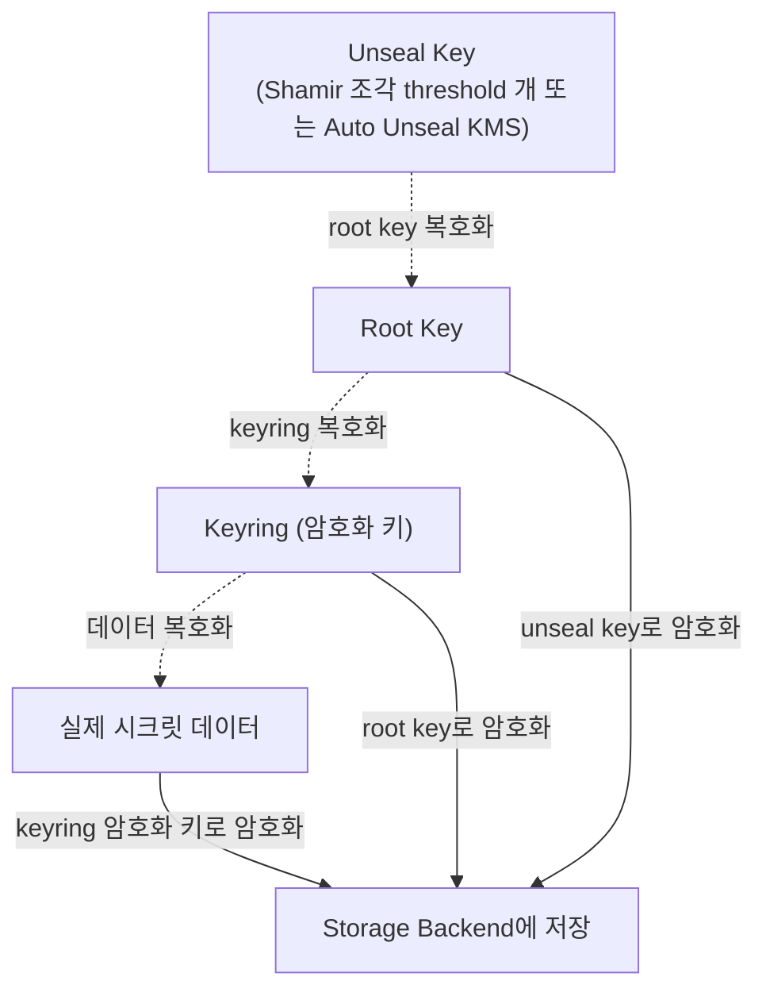
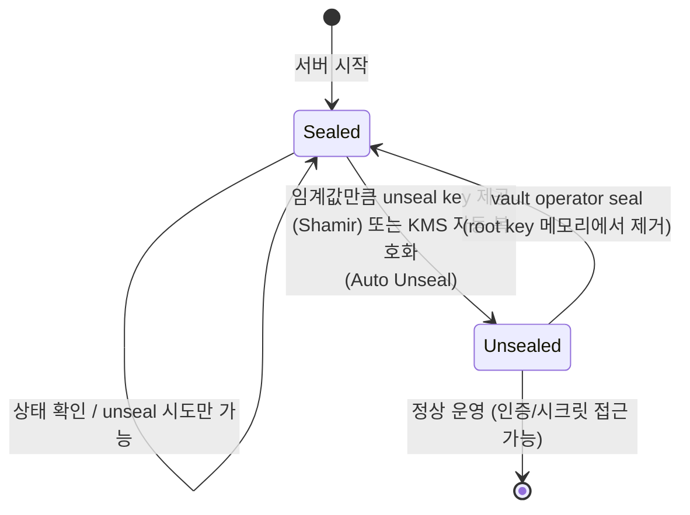
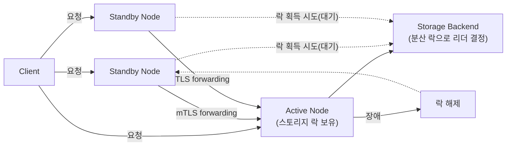
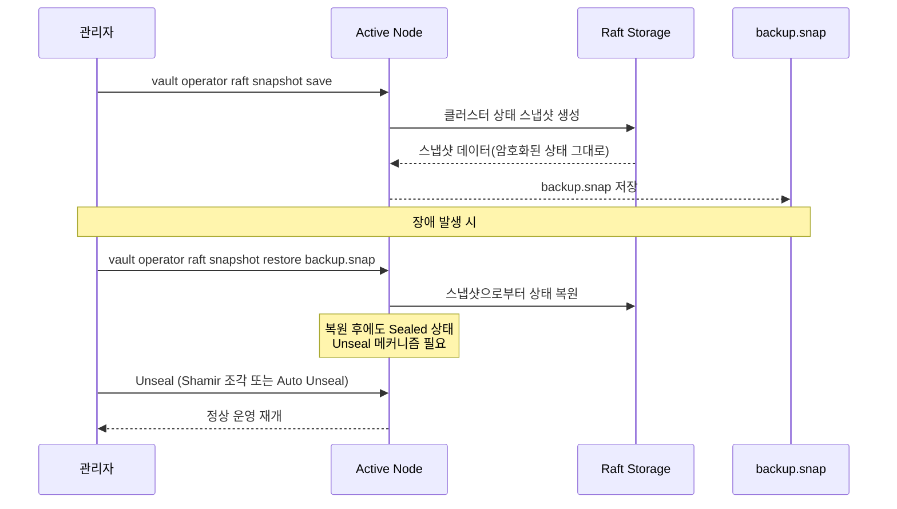

# 운영 (설치, Seal/Unseal, HA, 백업)

## 요약
- Vault 데이터는 **root key → keyring(암호화 키) → 실제 데이터**로 이어지는 계층적 암호화 구조로 보호되며, sealed 상태에서는 root key를 복호화할 수 없어 어떤 데이터도 읽을 수 없다.
- 기본값인 **Shamir's Secret Sharing**은 unseal key를 여러 조각(key shares)으로 나누고, 그중 임계값(key threshold) 개수만 모이면 복원되는 방식으로 단일 실패점을 없앤다. 클라우드 KMS 등을 쓰는 **Auto Unseal**은 재시작 시 자동으로 unseal되지만 별도 recovery key 체계를 갖는다.
- **HA**는 스토리지 백엔드의 분산 락(lock)으로 active 노드 하나를 선출하고, standby 노드는 요청을 active로 **forwarding**한다. Integrated Storage(Raft)가 신규 배포 시 기본 권장 백엔드다.
- 백업은 `vault operator raft snapshot save`로 클러스터 상태 전체를 스냅샷으로 저장하고, `restore`로 복구한다.

## 상세 설명

### 설치(Install)
공식문서가 안내하는 설치 경로는 세 가지다.

| 방식 | 설명 |
|---|---|
| 패키지 매니저 | "Install Vault Community edition with supported package managers for macOS, Ubuntu/Debian, CentOS/RHEL, Amazon Linux, and Homebrew"(공식문서) |
| Kubernetes/Helm | "Use helm to install Vault for Kubernetes"(공식문서) |
| 바이너리 | "Download a precompiled binary or build Vault from code and install the binary manually"(공식문서) |

### 서버 설정 파일(config.hcl) 주요 스탠자
| 스탠자 | 역할 |
|---|---|
| `storage` | "Configures the storage backend where Vault data is stored"(공식문서) — [[01_아키텍쳐]]의 Storage Backend에 대응 |
| `listener` | "Configures how Vault is listening for API requests"(공식문서) |
| `seal` | Auto Unseal 등 봉인(sealing) 방식을 설정 |
| `cluster_addr` | "Specifies the address to advertise to other Vault servers in the cluster for request forwarding"(공식문서) — 노드 간 통신 주소 |
| `api_addr` | "Specifies the address (full URL) to advertise to other Vault servers in the cluster for client redirection"(공식문서) — 클라이언트에게 알려줄 주소 |
| `disable_mlock` | "Stops Vault from executing the `mlock` syscall"(공식문서) — 메모리가 디스크로 스왑되는 것을 막는 `mlock`을 끌지 여부 |

```hcl
storage "raft" {
  path    = "/path/to/raft/data"
  node_id = "raft_node_id"
}

listener "tcp" {
  address       = "127.0.0.1:8200"
  tls_cert_file = "/path/to/full-chain.pem"
  tls_key_file  = "/path/to/private-key.pem"
}
```

### 초기화(`vault operator init`)
"Initialization is the process by which Vault's storage backend is prepared to receive data."(공식문서) 빈 스토리지 백엔드에 최초로 Vault를 붙였을 때 딱 한 번 수행한다.

초기화 시 Vault는 **root key**를 생성해 스토리지에 저장하는데, "The root key itself is encrypted and requires an unseal key to decrypt it."(공식문서) — 이 root key를 그대로 두지 않고 다시 unseal key로 암호화해 보관한다. 기본적으로 이 unseal key는 통째로 존재하지 않고, Shamir's Secret Sharing으로 "a configured number of shards (referred as key shares, or unseal keys)"(공식문서)로 쪼개져 생성된다.

| 플래그 | 기본값 | 의미 |
|---|---|---|
| `-key-shares` | 5 | "Number of key shares to split the generated master key into"(공식문서) |
| `-key-threshold` | 3 | "Number of key shares required to reconstruct the root key"(공식문서) |

```bash
vault operator init
# 또는 PGP 키로 각 조각을 암호화해서 배포
vault operator init -key-shares=3 -key-threshold=2 \
  -pgp-keys="keybase:hashicorp,keybase:jefferai,keybase:sethvargo"
```
초기화 결과로 **unseal key 조각들**과 **root token**(최초 관리자 토큰)이 함께 출력된다. root token은 [[04_정책]]의 root policy가 붙은 토큰이므로, 초기 설정이 끝나면 반드시 폐기(revoke)해야 한다.

### Seal / Unseal — 계층적 암호화 구조
Vault의 데이터 보호는 3단계로 이루어진다: "Vault encrypts the data using an encryption key (in the keyring) and stores them in its storage backend."(공식문서) 그리고 "To protect this encryption key, Vault encrypts it using another encryption key known as the root key."(공식문서)

```
실제 데이터 → keyring의 암호화 키로 암호화 → 저장
keyring 암호화 키 → root key로 암호화 → 저장
root key → unseal key로 암호화 → 저장
```

Sealed 상태에서는 Vault가 물리적 스토리지에는 접근할 수 있지만, "it cannot decrypt any of the data on it"(공식문서) — 즉 스토리지를 그대로 탈취당해도 unseal key 없이는 무의미한 암호문일 뿐이다. "Unsealing is the process of obtaining the plaintext root key that is necessary to read the decryption key."(공식문서)

**Sealed 상태에서 가능한 작업은 극히 제한적**이다: "Prior to unsealing, the only possible Vault operations are to unseal the Vault and check the status of the server."(공식문서) — 시크릿 조회는 물론 인증조차 불가능하다.

#### Shamir's Secret Sharing
"Instead of distributing the unseal key to an operator as a single key, the default Vault configuration uses an algorithm known as Shamir's Secret Sharing to split the key into shares."(공식문서) 관리자 한 명이 unseal key 전체를 쥐지 않게 해 단일 실패점(그리고 단일 내부자 위협 지점)을 없앤다. "Vault operators add shares one at a time in any order until Vault has enough shares to reconstruct the key."(공식문서) — 임계값만 채우면 순서 상관없이 복원된다.

#### Auto Unseal
클라우드 KMS/HSM에 root key 보호를 위임해 재시작 시 사람 개입 없이 자동으로 unseal되는 방식이다. 이 경우 Shamir의 unseal key 대신 **recovery key**라는 별도 체계를 쓰는데, 성격이 다르다: "Recovery keys cannot decrypt the root key and therefore are not sufficient to unseal Vault if the auto unseal mechanism isn't working."(공식문서) — recovery key는 KMS 자체가 살아있다는 전제하의 관리용 키이지, KMS를 대체해 직접 unseal할 수 있는 키가 아니다.

**복구 불가능 시나리오**: "If the seal mechanism or its keys are permanently deleted, then the Vault cluster cannot be recovered, even from backups."(공식문서) — KMS 키를 실수로 영구 삭제하면 스냅샷 백업이 있어도 클러스터를 복구할 수 없다. Auto Unseal을 쓴다면 KMS 키 삭제 방지(예: AWS KMS의 삭제 대기 기간, 키 정책)가 백업 전략의 일부가 되어야 한다.

#### Rekey / Seal Migration
- **Rekey**: "You can rekey Vault's unseal keys using a `vault operator rekey` operation"(공식문서) — key shares/threshold 변경, 키 보유자 교체(새 PGP 키), 정기 보안 갱신 등에 사용한다. recovery key도 별도로 rekey 가능하다.
- **Seal Migration**(Shamir ↔ Auto Unseal 전환): 기본적으로 "The seal migration operation requires both the old and new seals to be available during the migration."(공식문서)이며 "You cannot perform the seal migration process without downtime"(공식문서) — 다운타임이 필요하다. Vault 1.16.0+의 **Seal HA**(Enterprise) 기능을 쓰면 대부분의 auto-unseal 방식 간 무중단 전환이 가능하지만, "Seal HA does not support migrating Shamir seals."(공식문서) — Shamir가 관여하는 마이그레이션은 여전히 다운타임이 필요하다.

### High Availability (HA)
#### Active / Standby와 Leader Election
Vault를 여러 노드로 구성하면 하나만 활성화되고 나머지는 대기한다: "one of the Vault server nodes grabs a lock within the data store. The successful server node then becomes the active node; all other nodes become standby nodes"(공식문서) 별도의 합의 프로토콜을 Vault 애플리케이션 레벨에서 직접 구현하는 게 아니라, **스토리지 백엔드가 제공하는 분산 락**을 리더 선출에 그대로 활용하는 구조다. Active 노드가 죽어 락이 풀리면 다른 standby 노드가 락을 잡아 자동 failover가 일어난다.

#### Standby의 요청 처리: Request Forwarding
Standby 노드가 클라이언트 요청을 직접 받아도, 기본 동작은 그 요청을 active 노드로 대신 전달(forward)하는 것이다. 이를 위해 active 노드는 "a newly-generated private key (ECDSA-P521) and a newly-generated self-signed certificate designated for client and server authentication"(공식문서)으로 노드 간 mTLS 채널을 구성한다. 필요하면 클라이언트가 `X-Vault-No-Request-Forwarding` 헤더로 이 동작을 끄고 예전 방식(리다이렉트)으로 되돌릴 수 있다: "the standby nodes will redirect the client using a 307 status code to the active node's redirect address"(공식문서)

#### Integrated Storage(Raft)와 HA
"HashiCorp recommends Vault Integrated Storage as the default HA backend for new deployments"(공식문서) — Consul/ZooKeeper/etcd 같은 외부 스토리지 없이도, Vault 자체에 내장된 **Raft 합의 알고리즘**이 분산 락(=리더 선출)과 데이터 복제를 함께 처리한다. [[01_아키텍쳐]]에서 다룬 Storage Backend 계층이 곧 Raft 클러스터가 되는 셈이다.

### 백업 / 복구 (Integrated Storage 기준)
"All Vault editions support data backup and restoration with manual snapshots of the cluster state."(공식문서) — 수동 스냅샷은 커뮤니티 에디션에서도 가능하고, Enterprise는 여기에 더해 "configurable automated snapshots to local and cloud storage"(공식문서)로 자동화를 지원한다.

```bash
# 스냅샷 저장 (CLI)
vault operator raft snapshot save backup.snap

# 스냅샷 저장 (API)
curl --request GET \
  --header "X-Vault-Token: ${VAULT_TOKEN}" \
  ${VAULT_ADDR}/v1/sys/storage/raft/snapshot > backup.snap
```
API 경로는 `sys/storage/raft/snapshot`이며, 스냅샷은 "클러스터 상태(cluster state)"(공식문서) 전체를 담는다 — 즉 [[01_아키텍쳐]]의 Barrier로 암호화된 상태 그대로 저장되는 Raft 로그/스냅샷이므로, 스냅샷 파일 자체만으로는 복호화가 불가능하고 **unseal 메커니즘(Shamir 조각 또는 Auto Unseal용 KMS)이 그대로 살아있어야** 복구한 클러스터를 다시 unseal할 수 있다.

이 문서는 개요 수준까지만 확인했고, `vault operator raft snapshot restore`의 상세 절차(노드 재구성 여부 등)와 Enterprise 자동 스냅샷 설정은 아직 조사하지 않았다(필요 시 추가 조사 후 보강).

## 도식화 (Mermaid)

### 암호화 계층: Seal / Unseal


### Seal / Unseal 상태 전이


### HA: Active/Standby와 Request Forwarding


### 백업 / 복구 흐름


## 예시 (CLI)

```bash
# 초기화
vault operator init -key-shares=5 -key-threshold=3

# unseal (조각 3개 순서 상관없이 입력)
vault operator unseal <unseal-key-1>
vault operator unseal <unseal-key-2>
vault operator unseal <unseal-key-3>

# 봉인(재봉인) — 침입 감지 시 즉시 데이터 보호
vault operator seal

# rekey — unseal key 재생성
vault operator rekey -init -key-shares=5 -key-threshold=3

# HA 상태 확인
vault status   # sealed 여부, HA mode(active/standby) 표시

# 스냅샷 백업/복구
vault operator raft snapshot save backup.snap
vault operator raft snapshot restore backup.snap
```

## 참고 링크
- https://developer.hashicorp.com/vault/docs/concepts/seal
- https://developer.hashicorp.com/vault/docs/concepts/ha
- https://developer.hashicorp.com/vault/docs/commands/operator/init
- https://developer.hashicorp.com/vault/docs/sysadmin/snapshots/save
- https://developer.hashicorp.com/vault/tutorials/standard-procedures/sop-backup
- https://developer.hashicorp.com/vault/docs/install
- https://developer.hashicorp.com/vault/docs/configuration

> 참고: `raft snapshot restore`의 상세 절차, Enterprise 자동 스냅샷 설정, Seal HA(Enterprise) 세부 구성은 개요 수준으로만 확인했다. 필요 시 추가 조사 후 이 문서에 절을 보강한다.
