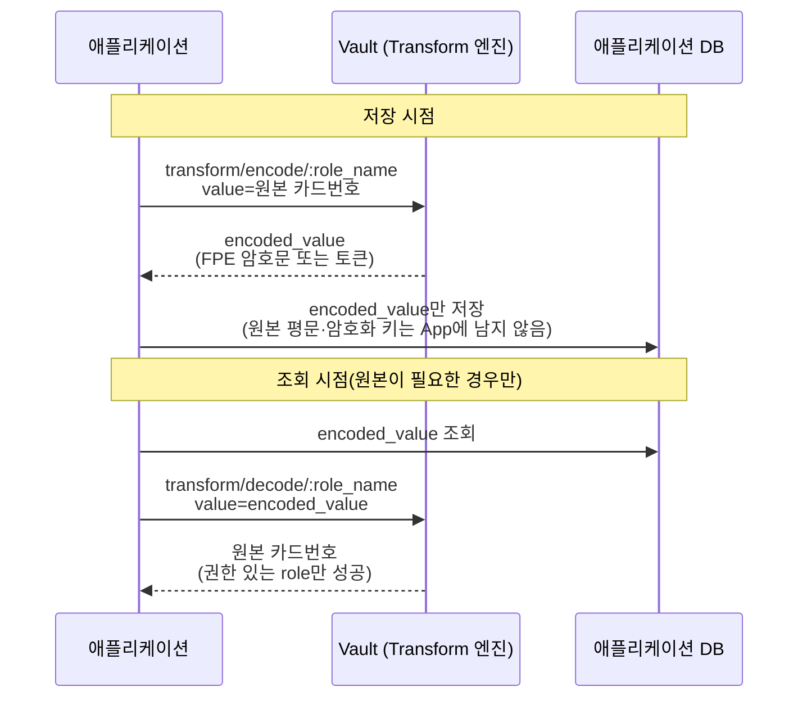
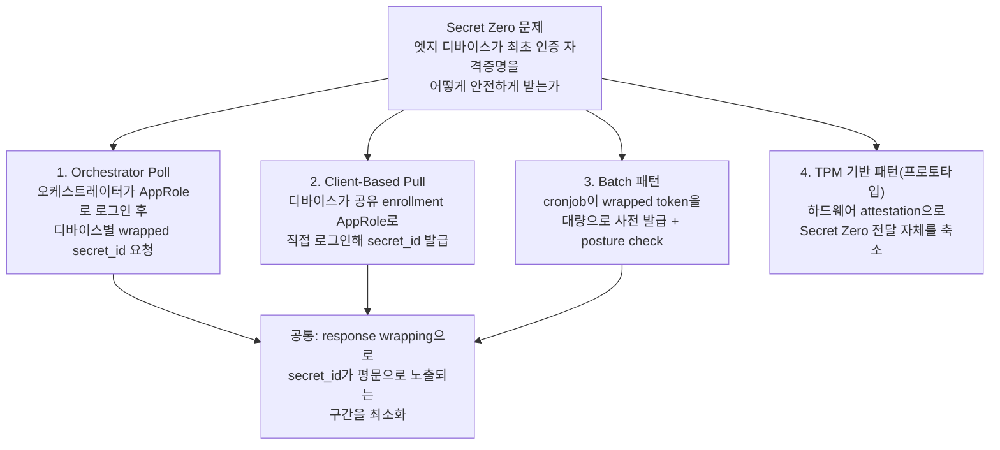
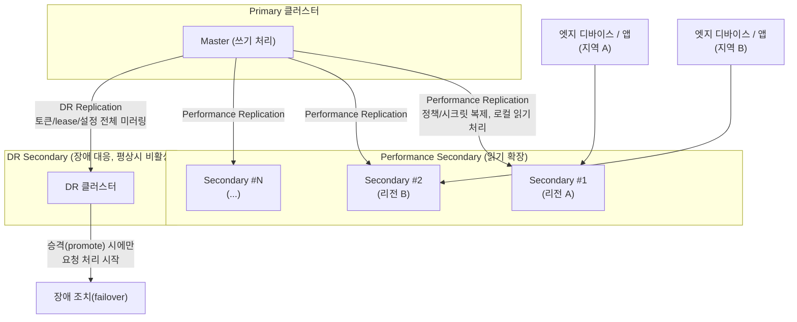
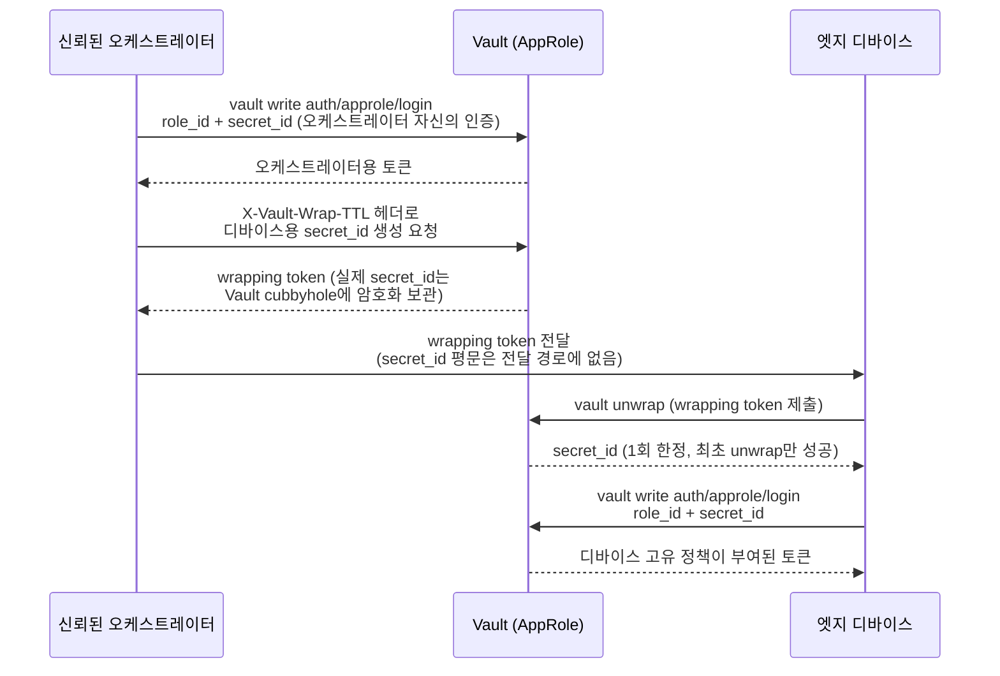

# 대기업 Vault 실제 사용사례

## 요약
- HashiCorp가 공식적으로 공개한 case study/컨퍼런스 발표 중, 프로덕션 규모와 아키텍처가 구체적으로 드러난 네 사례를 정리했다: **Adobe**(멀티 리전 Vault Enterprise 운영), **Starbucks**(10만+ 리테일 엣지 디바이스의 Secret Zero 문제 해결), **athenahealth**(헬스케어 시크릿 스프롤 통합), **결제 파이프라인 PCI 컴플라이언스**(2천만+ 카드 레코드 처리 환경, 카드번호 등 민감 데이터를 암호화·토큰화해 저장하는 사례).
- 앞의 세 사례(Adobe/Starbucks/athenahealth)의 공통 패턴: Vault Enterprise의 **Performance/DR Replication**으로 수평 확장·장애 대응을 하고, **AppRole + response wrapping**으로 자격증명을 안전하게 전달하며, **Terraform/Vault Agent**로 배포·정책·갱신을 코드로 자동화한다.
- 네 번째 사례(결제 파이프라인)는 성격이 다르다 — 앞의 세 사례가 "Vault에 시크릿을 넣어두고 꺼내 쓰는" 시크릿 스토리지 패턴이라면, 이 사례는 **카드번호·비밀번호 같은 민감 데이터를 애플리케이션이 암호화/토큰화한 뒤 그 결과값만 자체 DB에 저장**하는 **암호화 서비스(encryption as a service)** 패턴이다 — Vault의 **Transform**(또는 Transit) 시크릿 엔진이 여기 해당한다.
- 이 문서는 각 기업의 "현재" 내부 설계를 실시간으로 반영한 것이 아니라, HashiCorp가 공개한 자료(발표 시점 명시)를 요약한 것이다 — 이후 구성이 바뀌었을 수 있다.
- **한계**: 네 사례 모두 "구체적으로 어떤 시크릿을, 어떤 엔진으로, 어떻게 저장/전달했는지"와 "왜 트래픽이 많았는지"는 공식 자료에서 제한적으로만 공개된다. athenahealth는 별도 웨비나 덕분에 비교적 구체적(서비스 계정/앱 secret/키/TLS·SSH/DB 자격증명, Vault Agent+직접 API)이지만, Adobe·Starbucks는 시크릿 종류·트래픽 원인 모두 발표에 명시되지 않은 부분이 많다. **결제 파이프라인 사례는 실제 발표에서 카드 데이터 암호화 흐름 자체를 다루지 않아서, 그 부분은 HashiCorp 공식 블로그·문서의 권장 패턴으로 별도 구분해 보충했다** — "이 회사가 실제로 이렇게 구현했다"는 뜻이 아니라 "공식문서가 이런 상황에 권장하는 방식은 이렇다"는 의미다. 각 절의 소단락에 확인된 사실과 비공개·추정을 구분해뒀다.

## 상세 설명

### Adobe — 멀티 리전 Vault Enterprise 운영 (2년 회고, 발표: HashiConf)
Adobe Digital Marketing 인프라는 Fortune 50 고객의 47곳을 서비스하며, Vault Enterprise를 2년간 운영한 경험을 발표했다.

- **규모**: 130개 이상 팀이 사용, 누적 약 100조 건의 트랜잭션, 월 약 8억 건 요청, 평균 응답 시간 약 3ms(최악의 경우도 14~15ms 수준).
- **아키텍처**: 서부 해안 primary 데이터센터를 중심으로 리전당 3개 클러스터, 단일 master 클러스터에서 복제받는 11개 **performance secondary**, 그리고 AWS(서부) + 별도 동부 데이터센터에 **재해 복구(DR) 클러스터**를 둔 멀티 리전·멀티 클라우드(AWS + 온프레미스 + 계약상 제한 환경) 구성.
- **자동화**: Terraform으로 배포 템플릿 관리, SaltStack으로 설정 관리, AWS KMS 기반 **Auto Unseal**과 Rundeck으로 운영 자동화.
- **운영 관행**: Prometheus/Grafana로 클러스터 응답시간·처리량·seal 상태·복제 상태를 모니터링(내부 고객에게도 대시보드 공개). 신규 팀 온보딩 시 관리자와 15분 상담을 의무화해(한 팀이 실수로 1,000만 건 이상의 key-value 쌍을 넣은 사례를 계기로) 오용을 사전에 걸렀다. "Vault 101" 교육 프로그램으로 18개월 만에 1,000명 이상 트레이닝, 지원 부담을 크게 줄였다.
- **인증/시크릿**: 발표에서 service token과(멀티 클러스터 접근 복잡도를 낮춘) batch token 언급, KV v2 + metadata로 비용 센터(cost center)를 태깅해 사용.
- **교훈**: "82%의 기업이 재해 복구 계획이 없다"는 통계와 "다운타임 시간당 최소 10만 달러 손실"을 근거로, 멀티 리전 DR 구성이 필수적이었다고 강조.

#### 무엇을, 어떤 API로 저장했는가
- **시크릿 종류**: 발표 자료에 DB 자격증명·API 키 등 구체적 유형 나열은 없다("확실하지 않음"). 확인되는 것은 **KV v2 엔진** 사용과, 시크릿에 **metadata**를 태깅해 비용 센터(cost center)별로 구분·과금했다는 점, 그리고 한 팀이 실수로 **1,000만 건 이상의 key-value 쌍**을 넣은 사고 사례뿐이다.
- **인증 토큰 방식**: 초기에는 **service token**만 사용했으나, 멀티 클러스터(11개 performance secondary) 구조에서 클러스터마다 토큰을 따로 받아야 하는 복잡도를 줄이려고 **batch token**을 도입했다. batch token은 디스크에 영속화되지 않고 메모리에도 남지 않으며 replication 대상에서 제외되어, 클러스터 간 복제되어야 하는 service token보다 부하가 훨씬 적다.
- 앱/팀이 시크릿을 어떻게 읽는지(정적 1회 조회 vs Vault Agent를 통한 자동 갱신 등)에 대한 구체적 설명은 발표 자료에 없다.

#### 요청량(월 8억 건)이 높았던 이유
- 8억 건이라는 총량 자체의 직접적 원인(짧은 TTL, 주기적 폴링 등)을 발표에서 명시적으로 설명하지는 않는다. 다만 관련된 구체적 사고가 하나 언급된다 — 내부 사용자가 서비스 사용법을 제대로 이해하지 못한 채 **한 번에 60~70만 개의 service token을 요청**해 시스템 리소스를 소진시킨 사례다. service token은 클러스터 간 복제되어야 해서 부하가 크고, 이 문제가 batch token 도입의 직접적 계기가 되었다.
- 즉 "평상시 트래픽이 왜 많은가"에 대한 공식 설명은 없지만, "트래픽이 왜 문제가 되었는가"(대량 토큰 발급 오용 + service token 복제 비용)는 확인된다. 130개 이상 팀이 상시 접근한다는 규모 자체도 기본 트래픽을 끌어올리는 요인으로 보이지만, 이는 추정이며 발표에서 직접 인과관계를 밝히지는 않았다.

### Starbucks — 10만+ 리테일 엣지 디바이스의 Secret Zero 해결 (발표: 2023-03)
Starbucks는 16,000개 이상의 북미 매장, 10만 대 이상의 엣지 디바이스에 시크릿/신원(identity)을 배포하는 문제를 다뤘다. 발표자는 이를 "**Secret Zero 문제**"(디바이스가 Vault에 처음 인증하기 위한 자격증명을 애초에 어떻게 안전하게 심어주는가)로 규정했다.

- **복제 토폴로지**: Vault Enterprise의 **performance replica**로 엣지 디바이스가 접근하는 읽기 전용 클러스터를 지역별로 두어 수평 확장·리전 로드밸런싱을 하고, replication filtering으로 테넌트 간 물리적 격리를 구현. **DR 클러스터**로 신속한 장애 조치(failover)를 지원.
- **정책/신원을 코드로**: Terraform과 Helm(Kubernetes)으로 인프라·네트워크부터 Vault policy·identity까지 전부 코드화해 빠른 클러스터 배포와 테넌트 온보딩이 가능.
- **Secret Zero 해소 패턴 4가지** (모두 [AppRole](./02_인증방식.md) 기반):
  1. **Orchestrator Poll**: 신뢰된 오케스트레이터가 AppRole 자격증명으로 Vault에 로그인해, 각 디바이스용 **wrapped secret_id**(response wrapping)를 미리 요청해둔다.
  2. **Client-Based Pull**: 디바이스들이 공유된 "enrollment AppRole"로 직접 로그인해 자신의 고유 secret_id를 발급받는다.
  3. **Batch 패턴**: 스케줄된 cronjob이 wrapped token을 대량으로 미리 발급(provision)해두며, posture-check(디바이스 상태 확인) 기능을 포함.
  4. **TPM 기반 패턴**(프로토타입): Trusted Platform Module 하드웨어 신원으로 암호학적 attestation을 수행, Secret Zero 전달 자체를 일부 생략.
- **기타 기술 요소**: Vault Agent로 자동 인증/자격증명 갱신, 1년짜리였던 PKI 인증서를 더 짧은 TTL로 전환, 연결이 끊긴 엣지 환경을 위한 캐싱(Vault Agent caching) 활용.

#### 무엇을, 어떤 API로 저장/전달했는가
- **시크릿 종류**: 발표 자료는 Starbucks 고유의 시크릿 목록을 나열하지 않는다. 다만 Vault가 커버해야 할 범위로 "정적 key-value 시크릿부터 단기 PKI 인증서, 동적 데이터베이스/클라우드 접근 자격증명까지"를 언급하고, 매장 내 디바이스 종류가 **POS(결제) 단말기부터 온도 센서까지** 다양하다고 밝힌다 — 디바이스 성격상 결제 관련 자격증명, TLS 인증서, 센서용 API 키 등이 섞여 있었을 것으로 보이나, 어느 디바이스가 어떤 시크릿·엔진을 쓰는지 구체적 매핑은 공개되지 않았다("확실하지 않음").
- **엔진**: **PKI 엔진** 사용은 명확하다(기존 1년 만료 인증서를 더 짧은 TTL로 전환). KV·Transit 등 다른 엔진의 구체적 사용 여부는 발표에 명시되지 않았다.
- **전달/저장 방식**: 디바이스용 secret_id는 **response wrapping**으로 감싸 평문 노출 구간 없이 전달하고, 디바이스는 **Vault Agent의 caching API**를 로컬 응답자로 활용해 연결이 끊긴 엣지 환경에서도 이미 받아둔 자격증명을 계속 사용한다. 로컬 파일시스템 저장 여부 등 세부 구현은 공개 자료에 없다.

#### 요청량 관련
- 발표에 트래픽/요청량 수치는 공개되지 않았다. 10만 대 이상의 디바이스가 지역별 performance replica에 분산 접속하는 구조만 확인되며, "왜 트래픽이 많았는가"는 근거가 없어 이 문서에서 추정하지 않는다.

### athenahealth — 흩어진 시크릿을 Vault로 통합 (헬스케어, 미국 환자 기록 40%+)
athenahealth는 여러 자체 구축(homegrown) 시스템에 시크릿 관리가 흩어져 있어 발생하던 운영 부담을 Vault로 해소했다.

- **문제**: 10,000곳 이상의 고객, 16만 명 이상의 provider를 지원하며 시크릿 관련 티켓 처리에 기존에는 2~3일이 걸렸다. 중앙 지원팀이 최후 보루 역할을 하며 야간 대응 요청이 계속 늘어났다.
- **적용**: 수천 개의 시크릿을 Vault로 통합해 웹/DB/애플리케이션 서버에 배포하고, HashiCorp Consul의 provisioning/discovery 기능과 연계해 시크릿 정책 적용을 자동화. 하루 약 3억 건의 시크릿 요청을 처리.
- **결과**: 기존 수동 티켓 시스템을 사실상 폐지, 가용성 이슈 대응 시간을 4시간에서 30분 이내로 단축. 2,000명 이상의 개발자가 더 이상 중앙팀에 요청하지 않고 셀프서비스로 시크릿을 갱신.

#### 무엇을, 어떤 API로 저장/전달했는가
세 사례 중 유일하게 별도 웨비나(HashiCorp Justin Weissig + athenahealth SRE 리드 Jeff Byrnes 발표)에서 구체적인 시크릿 종류가 언급된다.

- **시크릿 종류(웨비나에서 명시)**: **service account, application secret, key, TLS 인증서, 비상 접근용 계정(emergency access account), SSH 키**, 그리고 웹 애플리케이션과 데이터베이스 간 통신에 쓰이는 **DB 자격증명**.
- **엔진**: 웨비나 시점에 발표자는 "**인증서 자동 갱신에 PKI 엔진을 쓰는 건 로드맵에 있다**"고 말했다 — 즉 그 시점엔 PKI 엔진이 아직 본격 프로덕션 적용 전이었을 가능성이 있다. Database secrets engine 등 다른 엔진명은 명시되지 않았고, case study의 "향후 dynamic secrets 기능 도입 예정"이라는 문구와 함께 보면 이 시점엔 **주로 정적(static) 시크릿 위주**였을 가능성이 있다 — 다만 이는 정황상 추정이며 공식적으로 "static KV만 썼다"고 단정한 문장은 없다.
- **접근 방식**: 두 가지가 병행된다. ① **Vault Agent**를 클라이언트 서버에 사이드카(daemon)로 배포해 로컬 API로 시크릿을 제공하는 방식, ② 일부 애플리케이션 스택이 **Vault API에 직접** 접근하는 방식 — 이때 **Consul**의 서비스 디스커버리로 Vault 엔드포인트를 찾는다.
- **배포/정책 자동화**: Puppet, Ansible, Terraform 등 구성관리 도구와 연동해 정책 적용을 자동화했다.

#### 요청량이 높았던 이유
- **주의(수치 불일치)**: 출처마다 하루 요청량 수치가 다르다 — 웨비나에서는 **"하루 9천만 건"**, 이후 공식 case study 페이지에서는 **"하루 3억 건"**으로 나온다. 웨비나가 먼저 발표되고 case study가 이후 갱신된 것으로 보여 시간이 지나며 사용량이 늘었을 가능성이 높지만, 두 자료 모두 시점을 명시적으로 비교하거나 증가 원인을 설명하지는 않는다. 이 문서의 "세 사례 비교" 표와 요약에는 더 최근 값인 3억 건을 대표 수치로 썼다.
- 요청량이 높은 이유 자체(헬스체크 빈도, TTL, 서버 인스턴스 수 등)에 대한 명시적 설명은 두 자료 어디에도 없다. 다만 구조적으로 참고할 만한 정황은 있다: (a) 10,000곳 이상의 고객·16만 명 이상의 provider를 지원하는 규모, (b) 웹/DB/애플리케이션 서버가 각각 Vault Agent 또는 직접 API로 개별 조회하는 구조, (c) 2,000명 이상의 개발자가 셀프서비스로 시크릿을 상시 갱신하는 운영 방식. 이 셋이 왜 요청량이 이만큼 컸을지 이해하는 데 참고는 되지만, 공식 자료가 직접 인과관계를 설명한 것이 아니므로 추정임을 명시한다.

### 결제 파이프라인 — PCI 컴플라이언스 카드 데이터 관리 (GitLab/DataRobot 엔지니어 발표)

앞의 세 사례와 달리, 이 사례는 "카드번호·비밀번호 같은 민감 데이터를 암호화된 상태로 서버에 저장"하는 문제를 정면으로 다룬다. 발표자 Nicholas Klick(현 GitLab)과 Apollo Catlin(현 DataRobot)이 **과거 함께 근무했던 회사**(연간 수십억 달러 규모 결제 파이프라인 운영, **2천만 건 이상의 신용카드 레코드** 관리)에서 Terraform·Vault로 PCI 컴플라이언스 아키텍처를 구축한 경험을 발표했다.

#### 실제 발표에서 확인되는 내용
- **문제**: PCI-DSS 컴플라이언스가 요구되는 대규모 결제 처리 환경을 수동 프로세스로 운영하며 겪은 부담(감사, 키 재발급 등).
- **Vault 활용 영역**: SSH 인증서 관리, **임시(dynamic) DB 자격증명**, **PKI 인증서 로테이션**("연 단위 재발급" 언급), 정책 기반 접근제어(RBAC), 감사 로깅. "encryption as a service"라는 표현이 등장하지만, **Transit/Transform 등 구체적 엔진명이나 카드번호 암호화 API 흐름은 발표 자료에 없다**("확실하지 않음").
- **자동화**: Terraform과 CI/CD 파이프라인을 통합해 컴플라이언스 워크플로 자체를 코드화·자동화하는 데 초점.

#### (보충) 카드 데이터 암호화 저장에 대한 공식 권장 패턴
> 아래 내용은 이 회사의 실제 구현이 아니라, 같은 상황(카드번호를 암호화/토큰화해 자체 DB에 저장)에 대해 **HashiCorp 공식 블로그·문서가 권장하는 방식**을 정리한 것이다. HashiCorp 공식 블로그("Achieving PCI compliance...")는 이 시나리오에 **Transform 시크릿 엔진**을 명시적으로 제시하며 PCI-DSS Requirement 2·4와 함께 특히 **Requirement 3(저장된 카드소지자 데이터 보호)**에 매핑한다.

- **Transform 엔진의 두 방식** (Vault **Enterprise** / HCP Vault Dedicated 전용 — OSS Vault에는 없음):
  - **FPE(Format-Preserving Encryption)**: FF3-1 알고리즘으로 암호화하되 원본과 **같은 포맷·길이**를 유지. **가역적**(encode ↔ decode)이라 원본 카드번호가 필요한 시점에 복호화 가능.
  - **Tokenization**: 민감값을 원본과 수학적으로 무관한 **토큰**(Base58 인코딩, 길이가 원본과 다를 수 있음)으로 치환. **비가역적**이며 상태 저장(stateful)이라 별도 토큰 저장소가 필요하다. PCI-DSS 관점에서는 토큰만 갖고는 원본을 복구할 수 없으므로, 토큰만 다루는 시스템은 카드 데이터 컴플라이언스 감사 범위(scope)에서 제외/축소할 수 있다는 것이 핵심 이점이다.
- **흐름**: 애플리케이션이 원본 카드번호를 `transform/encode/:role_name` API로 넘기면 Vault가 FPE 암호화값 또는 토큰을 반환하고, 애플리케이션은 **그 결과값만** 자체 DB에 저장한다(원본 평문과 암호화 키 모두 애플리케이션에 남지 않는다). 원본이 필요할 때는 `transform/decode/:role_name`으로 역변환을 요청한다.
- **키 로테이션**: tokenization transform은 `POST /transform/tokenization/keys/:transform_name/rotate` API로 named key를 로테이션할 수 있으며, 로테이션 이후의 신규 encode 요청부터 새 키 버전이 적용된다.

#### 요청량 관련
- 이 발표에는 요청량(트래픽) 수치가 공개되지 않았다.

### 네 사례 비교

| 항목 | Adobe | Starbucks | athenahealth | 결제 파이프라인(PCI) |
|---|---|---|---|---|
| 핵심 문제 | 초대형 규모의 안정적 서비스(SLA) | 엣지 디바이스의 Secret Zero | 흩어진 시크릿의 운영 부담 | 카드 데이터를 암호화 저장 + PCI 감사범위 축소 |
| Enterprise 기능 | Performance secondary 11개 + DR | Performance replica + DR, replication filtering | (명시적 언급 없음, Consul 연계) | Transform 엔진(Enterprise 전용, 발표엔 미상세) |
| 인증 방식 | Service token / batch token | AppRole(4가지 부트스트랩 패턴) + response wrapping | (명시적 언급 없음) | (명시적 언급 없음) |
| **저장 시크릿(공개된 범위)** | KV v2 + metadata(구체 유형은 비공개) | PKI 인증서 중심(그 외는 일반론만 언급, 비공개) | service account/앱 secret/key/TLS/SSH 키/DB 자격증명 | 신용카드 번호(발표는 "암호화 서비스"만 언급, 엔진명 비공개) |
| **시크릿 엔진** | KV v2 (그 외 비공개) | PKI (그 외 비공개) | 웨비나 시점 PKI는 "로드맵" — 정적 KV 위주로 추정 | 발표엔 비공개 — **공식 권장은 Transform(FPE/tokenization)** |
| **접근 방식** | (구체적 설명 없음) | response wrapping + Vault Agent caching | Vault Agent 사이드카 + 직접 API(Consul 디스커버리) | (공식 권장) `transform/encode`·`transform/decode` API 호출 |
| 자동화 도구 | Terraform, SaltStack, Rundeck | Terraform, Helm, Vault Agent | Consul, Puppet, Ansible, Terraform | Terraform + CI/CD |
| 대표 성과 지표 | 평균 응답 ~3ms, 월 8억 요청 | 10만+ 디바이스, 16,000+ 매장 | 티켓 시스템 폐지, 대응 4시간→30분 | 2천만+ 신용카드 레코드 |
| **요청량이 높은 이유** | 명시적 설명 없음(대량 토큰 오용 사고는 확인) | 요청량 수치 자체가 비공개 | 명시적 설명 없음(출처 간 9천만↔3억 건 수치 불일치) | 요청량 수치 자체가 비공개 |

## 도식화 (Mermaid)

### 결제 파이프라인: Transform 엔진을 이용한 카드 데이터 암호화/토큰화 저장 흐름 (공식 권장 패턴)


- **FPE**: 위 흐름이 그대로 가역적 encode/decode. **Tokenization**은 원리는 같지만 반환값이 원본과 무관한 토큰이고, Vault 내부에 토큰↔원본 매핑을 저장(stateful)한다는 점이 다르다.
- PCI-DSS 관점에서 tokenization을 쓰면 `encoded_value`만 다루는 시스템(App DB, 로그, 백업 등)은 카드 데이터 자체를 갖지 않으므로 컴플라이언스 감사 범위에서 빠지거나 축소될 수 있다는 것이 핵심 이점이다.

### Starbucks: Secret Zero 문제를 푸는 4가지 패턴


### Adobe/Starbucks: Vault Enterprise 복제 토폴로지


### Orchestrator Poll 패턴의 일반화된 흐름 (공식 AppRole + response wrapping 기반)


## 예시 (CLI / API)

아래는 위 "Orchestrator Poll" 패턴을 재현하는 **일반화된 공식 Vault CLI/API 예시**다(특정 기업의 실제 명령어가 아니라 공식문서의 AppRole·response wrapping API를 조합한 것).

```bash
# 1) 오케스트레이터가 자신의 AppRole로 로그인
vault write auth/approle/login \
  role_id="<orchestrator-role-id>" \
  secret_id="<orchestrator-secret-id>"

# 2) 디바이스용 AppRole의 secret_id를 "wrapping"해서 생성
#    (X-Vault-Wrap-TTL 헤더 = wrapping token의 TTL)
curl --header "X-Vault-Token: <orchestrator-token>" \
     --header "X-Vault-Wrap-TTL: 60s" \
     --request POST \
     "$VAULT_ADDR/v1/auth/approle/role/edge-device/secret-id"
# 응답에는 실제 secret_id 대신 wrapping_token만 담긴다

# 3) 디바이스가 wrapping token을 받아 최초 1회만 unwrap
vault unwrap <wrapping_token>
# 이후 반환된 role_id + secret_id로 디바이스 자신의 AppRole 로그인
vault write auth/approle/login \
  role_id="<edge-device-role-id>" \
  secret_id="<unwrapped-secret-id>"
```

아래는 결제 파이프라인 사례에서 다룬 "카드번호 암호화 저장"을 재현하는 **일반화된 공식 Vault CLI 예시**다(발표 회사의 실제 명령어가 아니라 공식 Transform secrets engine 문서의 API를 조합한 것 — Transform 엔진은 Vault **Enterprise**/HCP Vault Dedicated 기능이다).

```bash
# 1) FPE(Format-Preserving Encryption) transformation 정의 — 카드번호(ccn) 템플릿 사용
vault write transform/transformations/fpe/ccn-fpe \
  template=ccn tweak_source=internal allowed_roles=payments

# 2) 위 transformation을 사용할 role 생성
vault write transform/role/payments transformations=ccn-fpe

# 3) 애플리케이션이 원본 카드번호를 암호화(encode) — 반환값만 DB에 저장
vault write transform/encode/payments value=1111-2222-3333-4444

# 4) 원본이 필요할 때만 복호화(decode)
vault write transform/decode/payments value=<encoded-value>

# (tokenization을 쓰는 경우) 토큰화 키 로테이션 — 이후 encode 요청부터 새 키 버전 적용
curl --header "X-Vault-Token: <token>" \
     --request POST \
     "$VAULT_ADDR/v1/transform/tokenization/keys/<transform_name>/rotate"
```

## 참고 링크
- https://www.hashicorp.com/en/resources/keep-it-secret-safe-everywhere-2-years-vault-enterprise-adobe (Adobe, HashiConf 발표)
- https://www.hashicorp.com/en/resources/starbucks-secrets-at-the-retail-edge-with-hashicorp-vault (Starbucks, 2023-03)
- https://www.hashicorp.com/en/case-studies/athenahealth
- https://www.hashicorp.com/resources/scalable-secret-storage-with-vault-at-athenahealth (athenahealth 웨비나 — 시크릿 종류·엔진·접근 방식·"하루 9천만 건" 수치의 출처. case study의 "하루 3억 건"과 시점이 다름)
- https://www.hashicorp.com/en/events/webinars/secrets-management-with-athenahealth (같은 웨비나의 개요 페이지, 발표자 정보)
- https://www.hashicorp.com/en/resources/managing-pci-compliant-architectures-at-scale-with-terraform-and-vault (결제 파이프라인, GitLab/DataRobot 엔지니어 발표 — 2천만+ 카드 레코드)
- https://www.hashicorp.com/en/blog/achieving-pci-compliance-leveraging-hashicorp-vault-to-protect-payment-data (HashiCorp 공식 블로그 — Transform 엔진의 PCI-DSS Req 2/3/4 매핑)
- https://developer.hashicorp.com/vault/docs/secrets/transform (Transform secrets engine 공식 문서 — FPE/Tokenization/Masking)
- https://developer.hashicorp.com/vault/docs/concepts/transform (Transform 개념 문서)
- https://developer.hashicorp.com/vault/api-docs/secret/transform (Transform HTTP API — encode/decode/rotate 엔드포인트)
- https://developer.hashicorp.com/vault/docs/enterprise/replication (Performance/DR Replication)
- https://developer.hashicorp.com/vault/docs/concepts/response-wrapping
- https://developer.hashicorp.com/vault/docs/auth/approle
- https://www.hashicorp.com/en/case-studies (HashiCorp 공식 case study 목록)

> 참고: 이 문서의 수치·아키텍처 설명은 위 발표/케이스 스터디 시점 기준이며, 각 기업의 현재 실제 구성을 실시간으로 반영하지 않는다. "예시" 절의 CLI 명령은 패턴을 설명하기 위해 공식 API를 조합한 것으로, 각 기업이 실제로 사용하는 스크립트/코드가 아니다.
